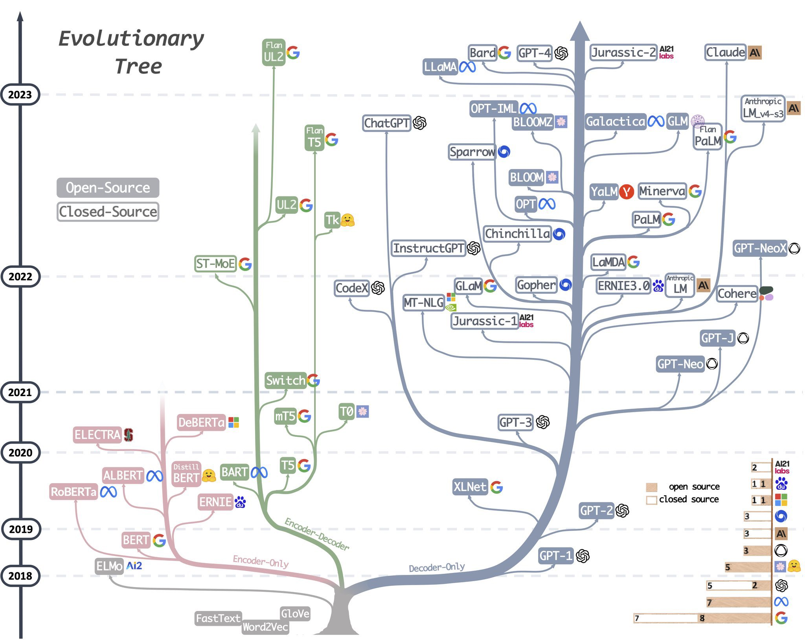
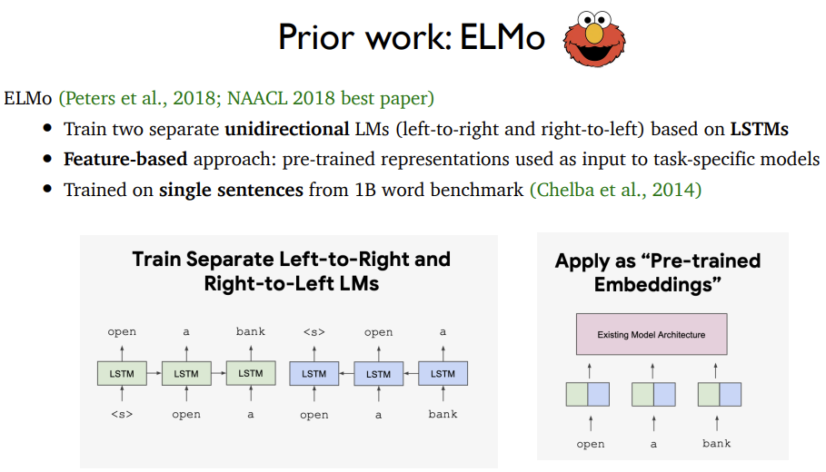
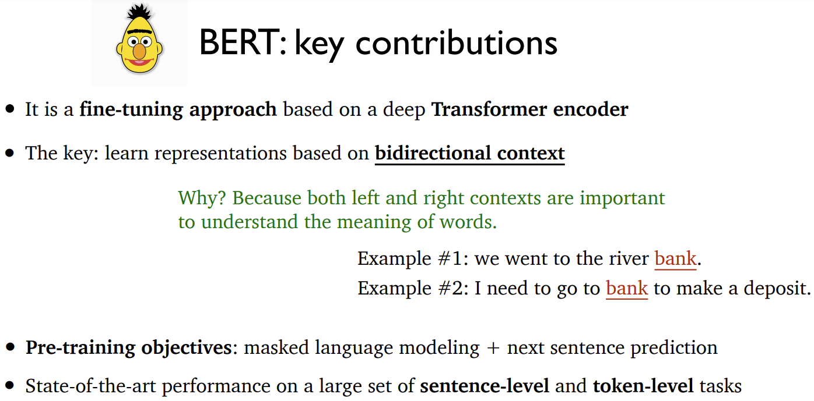
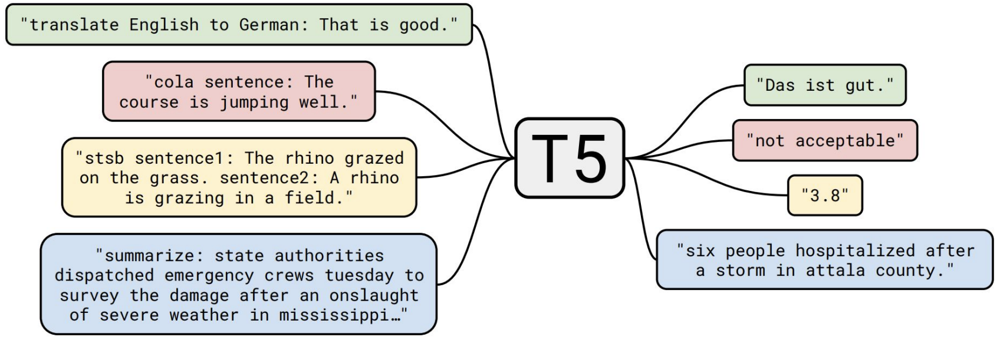
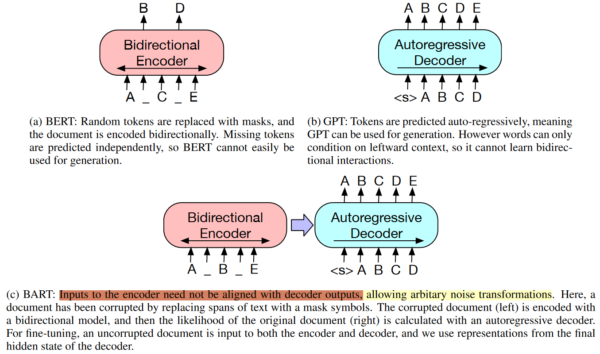
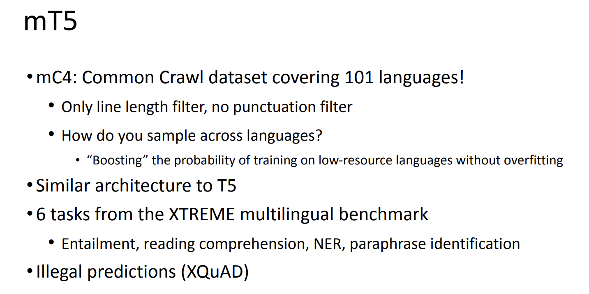
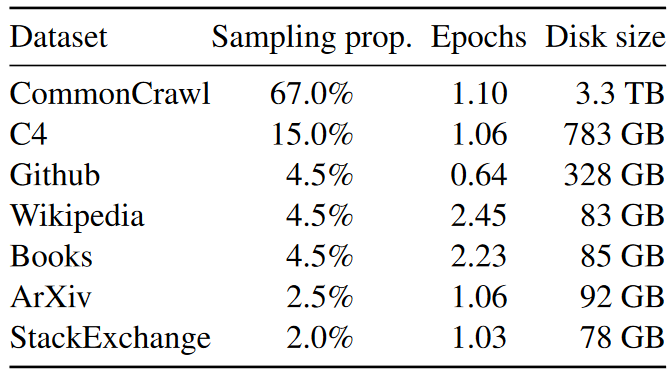
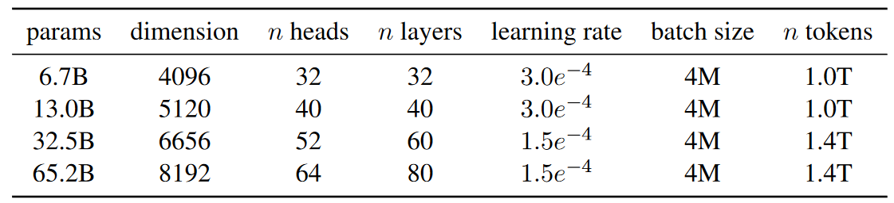
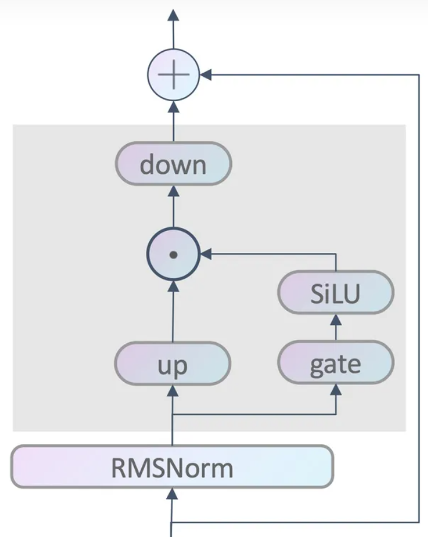
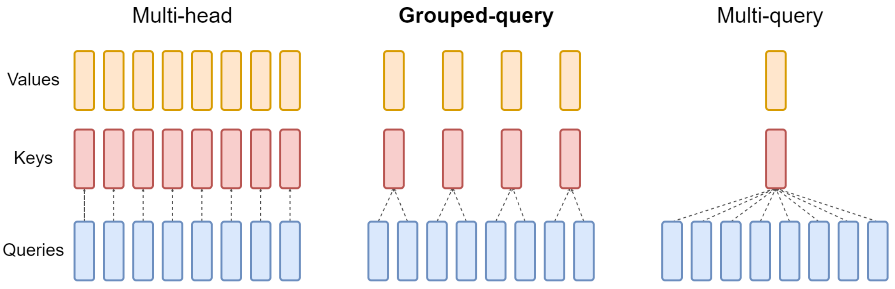

# PLMs

## Encoder-only

**ELMo**

ELMo 可以认为属于 Word2Vec、GloVe 等静态词向量 (Feature-based) 的工作，用两个单独的 LSTMs (一个从左到右一个从右到左)对输入文本进行编码，然后用得到的词向量运用在各个 task-specific 的模型中

**BERT**

* 词表：30000 个 ==character-level== 的 ==BPE(Byte Pair Encoding) wordpieces==

* MLM 策略：一般而言，挑选句子中的 ==15%== 的 token 进行 mask

  * 挑选的 mask token 太少：计算成本过高 (模型收敛太慢)
  * 挑选的 mask token 太多，导致输入的上下文信息过少，训练效果差

  选中的 mask token，80% 的概率会被替换为 [mask]；10% 的概率会被替换为词表中的其他任意词；10% 的概率保持不变。这样做的原因是：*在微调时，输入中是没有 [mask] 的*

  BERT 中是 token-level 的 MLM，后面也有了 span-level 的 MLM

*在 BERT 之后，涌现了许多其他 PLMs 的工作*

**通用 PLMs**

* **RoBERTa：**相比于 BERT，他有如下变化：

  1. 动态掩码：同一个句子在不同 epoch 中掩码的结果是不同的
  2. 去除了 NSP loss
  3. 使用更大的 batch size、更多的训练数据 (10x)、更长的训练时间
  4. character-level BPE -> bytes-level BPE (BBPE)

* **ALBERT：**相比于 BERT，他主要想把模型“轻量化”：

  1. 减少了输入 embedding 的参数量：input_embedding 的维度不再与 transformer block 隐藏层维度相等，而是用一个小的长度，再投影到隐藏层维度
  2. 共享所有层的参数：简言之就是每一层 transformer block 都用同一份参数，具体分为三种模式：只共享 attention 相关参数、只共享 FFN 相关参数、共享所有参数
  3. NSP loss -> SOP (Sentence Order Prediction) loss：预测两句话有没有被交换过顺序

* **ELECTRA：**新的预训练任务和框架

  

  (有一种 GAN 的感觉) 生成器和判别器都是一个 encoder，生成器用于还原 mask token，判别器判断每个 token 是否被替换过 (Replaced Token Detection，RTD)，下游任务微调我们只用判别器就好了，里面有一些细节要注意：

  1. 判别器的梯度无法传递到生成器，他们两个从梯度视角是独立训练的
  2. mask 的选取是直接随机选取 15% tokens 进行 mask，直接 mask，不考虑 80% mask、10%不变、10%随机替换，因为没必要，我们最终用的是判别器去微调
  3. 判别器会对每个 token 计算 loss，不仅仅是 mask token
  4. 因为判别器的任务更容易一些 (二分类)，所以判别器的 loss 通常会乘以一个系数

* **UniLM：**仍然使用一个 Encoder，但是在 MLM 任务的基础之上还加上了 seq-to-seq 的训练方式，具体使用哪种训练方式是用 attention mask 来决定的，例如实现 seq-to-seq 的时候，S1 [SEP] S2 [SEP]，把 S1 用完全可见的 attention mask，对 S2 用 Left-to-Right 的 attention mask 即可

  

**特殊的 PLMs：**

* 处理更长(> 512 tokens) 的上下文：Longformer、Big Bird
* 多语言 BERT
* 特殊领域的 BERT：SciBERT、BioBERT、FinBERT、ClinicalBERT
* 把 BERT 做的更小：DistillBERT、TinyBERT

## Encoder-Decoder

**T5**

核心思想是要达成 transfer learning 的目标，具体来说是想要把所有任务都建模在 “text-to-text” 的框架之下

对于每种任务，都将输入输出转变为 ==“[Task-specific prefix]: [Input Text]” -> “[Output Text]”==，如下图所示，分别展现了翻译、分类、回归(句子相似度)、摘要任务示例

训练细节：

* 数据：C4 (750G)

  以下的决策都是进行了广泛的实验，挑选出来的最好方案组合在一起，属于“大力出奇迹”

* Transformer Encoder-Decoder 模型；
* BERT-style 式的破坏方法
* Replace Span 的破坏策略 (Span-level MLM)
* 15 %的破坏比
* 破坏 span 长度 = 3

**BART**

具体来说，Encoder 部分添加了如下几种“噪音”：

* **Token Masking：**: 就是 BERT 的方法，随机将 token 替换成 [MASK]
* **Token Deletion：** 随机删去 token
* **Text Infilling：** 随机将一个 span 替换成一个 [MASK]
* **Sentence Permutation**: 将一个 document 的句子打乱
* **Document Rotation**: 从 document 序列中随机选择一个 token，然后使得该 token 作为 document 的开头

**mT5**

T5 的多语言版本

然后就是注意现在的用 Instruction Tuning 做的一些模型：

* T0
* Flan
* Flan UL2

## Decoder-Only

### LLaMA 1: Open and Efficient Foundation Language Models

核心思路：

1. LLaMA 主要考虑推理预算，用更多的 tokens 训练更小的模型，获得和较大模型相当的性能，达到推理预算和性能的平衡
2. 开源，数据 + 模型开源，数据开源指的是只用公开可获取的数据集，不用私有数据进行训练

最终开放了 7B、13B、33B 三个 size 的模型

* **训练数据**

  

  数据预处理提到了 [CCNet pipeline]()。预处理核心是质量过滤，主要包括去重、n-gram LM 做低质量数据的过滤、语言识别(例如只保留英文文本)等等

  分词用的是 **BPE**，数字是拆分成单个数字来处理的，fallback to bytes to decompose unkown UTF-8 characters

* **架构**

  基本沿用了 transformers 的 decoder 架构，但也集百家之所长，进行了一些修改：

  1. **Pre Normalization (from GPT3):** 在 transformers layer 的输入前做 norm 而不是对输出做 norm
  2. **SwiGLU activation function (from PaLM):** 舍弃了 ReLU，使用 SwiGLU 做激活函数，并且维度用的是 $\frac{2}{3}4d$，而不是 PaLM 中的 $4d$
  3. **Rotary Embeddings (from GPTNeo):** 舍弃了绝对位置编码，使用旋转位置编码

  

* **训练**

  优化器用的就是 AdamW => $\beta_1=0.9, \beta_2=0.95$，用的是 cosine learning rate schedule，2000 步的预热，weight decay = 0.1，gradient clipping = 1.0

  训练这么大的模型，LLaMA 也是想了很多办法来节省显存，实现**高效实现**：

  1. flash attention
  2. 减少反向传播时激活函数值的计算 => 手动实现 transformers layers 的反向传播函数而不是依赖 pytorch 的自动梯度计算
  3. [model and sequence parallelism](https://arxiv.org/abs/2205.05198)
  4. 使用 `all_reduce` 操作尽可能地将激活函数值计算和 GPUs 的通信重叠起来

**对 GLU (Gated Linear Units) 的补充：**

GLU（Gated Linear Units）是一种神经网络层，其定义涉及到输入的**两个线性变换的逐元素积，其中一个经过了 sigmoid 函数的处理**。GLU 包含以下组件：

1. 输入（x）：神经网络的输入。
2. 权重矩阵 W 和 V：用于进行线性变换的两个权重矩阵。
3. 偏置项 b 和 c：用于调整线性变换的偏置项。
4. Sigmoid 激活函数：将第一个线性变换（xW + b）通过 sigmoid 函数处理。

$$
GLU(x,W,V,b,c) = \sigma(xW+b)\otimes(xV+c)
$$

其中 $\sigma$ 表示 sigmoid 函数，$\otimes$ 表示 element-wise 乘积

理解了 GLU 之后，`SwiGLU` 等变种就非常好理解了

1. ReGLU：使用 ReLU 代替 sigmoid
2. GEGLU：使用 GELU 代替 sigmoid
3. SwiGLU：使用 Swish 代替 sigmoid

$$
ReGLU(x, W, V, b, c) = max(0, xW+b)\otimes(xV+c)	\\
GEGLU(x, W, V, b, c) = GELU(xW+b)\otimes(xV+c)	\\
SwiGLU(x, W, V, b, c) = Swish(xW+b)\otimes(xV+c)	\\
where \qquad Swish(x) = x * \sigma(x)
$$

llama 中的 FFN 结构如下图所示

对应公式 $SwiGLU(x, W, V, b, c) = Swish(xW+b)\otimes(xV+c)$

* `gate` 层就是上式中的 $W$ 和 $b$，同时会把维度升到 $\frac{2}{3}4d$
* `up` 层就是上式中的 $V$ 和 $c$，会把维度升到 $\frac{2}{3}4d$
* `SiLU` 就是激活函数 $SiLU(x) = x * \sigma(x)$ 

更细节一些，LLaMA 的 FFN 升维不是升成 $4d$，而是生成 $\frac{2}{3}4d$，以 LLaMA-7b 为例，隐藏层维度为 4096，那么对应的 $\frac{2}{3}4d=10923$(四舍五入向上取整了)，但是**为了硬件的执行效率，还会把维度向上取整到 128 的倍数**，因此最终维度为 11008

### LLaMA 2: Open Foundation and Fine-Tuned Chat Models

在 LLaMA 1 的基础上改进了基座模型，同时用 SFT 和 RLHF 微调了一个 chat 版本

**和 LLaMA 1 的区别：**

1. 在新的公开数据集集合上训练，新的预训练数据比原来大了 40%，总体训练量是 2T tokens

2. 上下文窗口从 2048 拓展到了 4096，翻了一倍

3. 采用 **grouped-query attention (GQA)**：相当于在 multi-head attention (MHA) 和 multi-query attention (MQA) 之间平衡了一下。MHA 是独立的 n 个 q、k、v；MQA 是 n 个 q 共享一组 k、v；那么 GQA 就是给 q 分组，例如 8 个头分 4 个组，每两个 q 共享一组 k、v (只有 32b 和 70b 两个版本的才使用了 GQA)

   

**LLaMA 3 和前两代的区别:**

1. llama 1,2 都使用 SentencePiece 进行分词, llama3 使用 openai 的 Tiktoken, 同时引入了 ChatFormat 类、特殊令牌来增强聊天交互和对话处理 => Tiktoken 也是基于 bpe 的分词方法, 但是速度更快, 对 CoreBPE 类用 rust 进行了重写, 包括多线程, regex, cache, 哈希等优化

2. llama3 的词表大小大幅提高, 由 llama1,2 的 32k 提升到了 128k

3. llama3 的训练数据量大幅提高, 达到了 15 万亿 tokens (llama1 => 1.4 万亿左右; llama2 => 2 万亿左右), 同时训练时长大幅增加

4. llama3 支持代码输出, 同时训练数据中有 5% 的非英文数据集, 支持的语言有 30 种左右, 但是效果肯定是英文最好, 不过给其他领域做进一步的语言对齐会更简单了

5. 上下文窗口翻倍, 支持 8k 的上下文窗口

**LLaMA 3.1 新增特性:**

1. llama3.1 新增 function calling 功能

2. 上下文窗口更长, 直接来到了 128k

3. 模型做的更大了, 最大来到了 405B