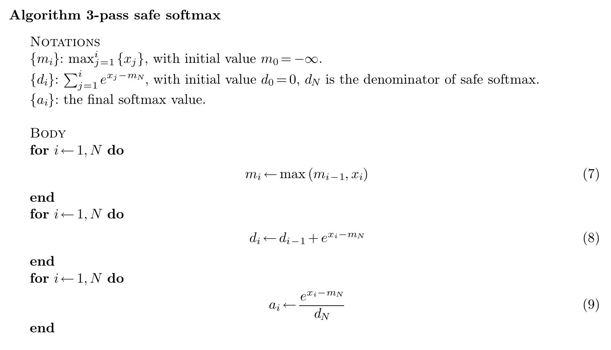
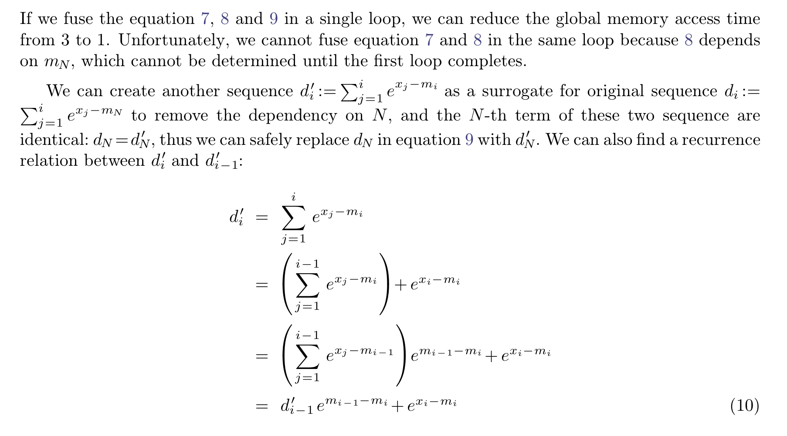
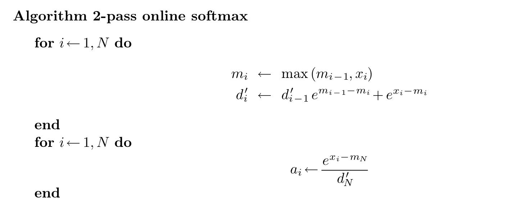
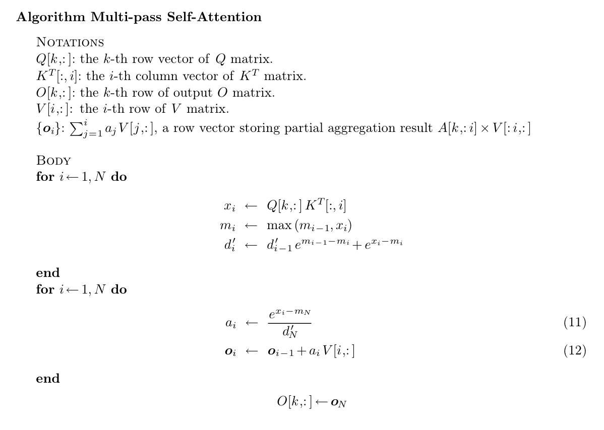
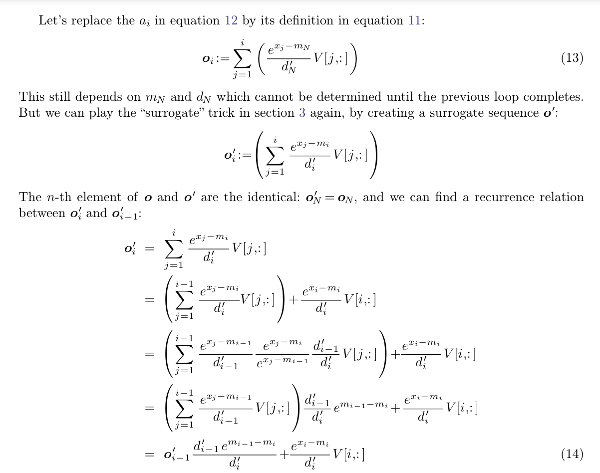
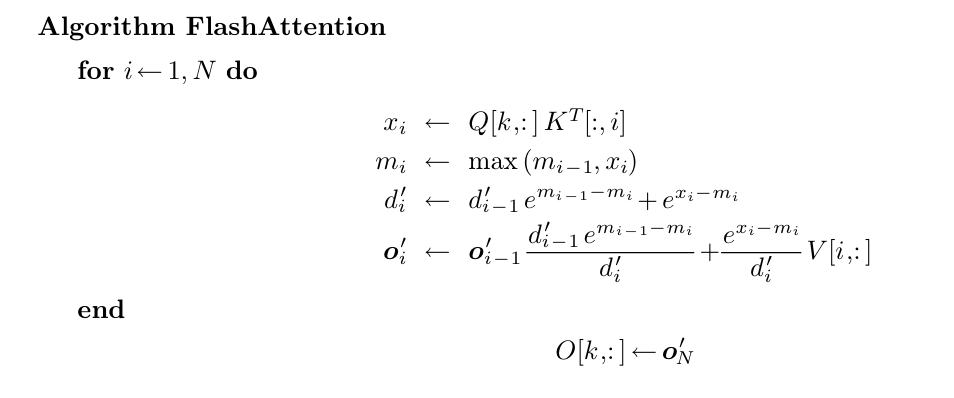

# FlashAttention (V1-V4)

[知乎详解](https://zhuanlan.zhihu.com/p/668888063)

[From Online Softmax to FlashAttention](https://courses.cs.washington.edu/courses/cse599m/23sp/notes/flashattn.pdf)

(目前只简单记录到了 flashattention-v1, 详细内容看上面的知乎, 写的非常好, 不过更新的 v3-v4 内容也没有了, 需要另外找)

## Online Softmax
理解 flashattention 从 online softmax 出发更加容易, 1-pass attention 就基于此

### Standard Self-Attention
一般的, 自注意力计算都分为 3 步:

$$
    S = QK^T, (N * d) \\
    P = Softmax(S), (N * N) \\
    O = PV, (N * d)
$$

3-pass 的算法中，步骤一和步骤二，会分别产生两个中间矩阵 S 和 P，内存需求均是 O(N^2)，HBM IO Accesses 需求是 O(Nd+N^2)。因此，如果采用这种原始的实现，当 seqlen 也就是 N 很大时，就会爆显存，同时 GPU HBM 的访存压力也会急剧变大。

### (Safe) Softmax: 3-pass
safe softmax，它的原理很简单。相对于原生的softmax，它先减去一个 max 值，以确保计算过程中不会导致数值溢出

$$
safe-softmax = \frac{e^{x_i}}{\sum_{j=1}^N{e^x_j}} = \frac{e^{x_i-m}}{\sum_{j=1}^N{e^x_j-m}}, m = max_{j=1}^N(x_j)
$$

工程上可以像上图那样实现, 这个算法要求我们对 [1,N] 重复3次。在 Transformer 的 Self-Attention 的背景下，x 是由 Q*K^T 计算的 pre-softmax logits。这意味着，如果我们没有足够大的 SRAM 来保存 pre-softmax logits (显存需求为O(N^2))，就需要访问 Q 和 K 三次，并实时重新计算 x，对于访存 IO 来说，这样是非常低效的。

### Online Softmax: 2-pass

上图中我们发现要 (8) 依赖 (7) 的结果，必须等上一步算完了才能计算, 于是我们尝试更改一下 $d_i$ 的计算方式，如下图所示, 会发现 $d_i'$ 只依赖于 $d_{i-1}'$，于是我们就可以把他们合并在一个循环里算了 => 避开了 O(N^2) 的显存需求

### Flashattention v1
接着2-pass online softmax继续思考，既然2-pass都整出来了，那么，我们还能不能整一个1-pass online softmax算法呢？遗憾的是，对于safe softmax并不存在这样的1-pass算法。但是！Attention的目标，并不是求softmax，而是求最终的O

利用前面的 2-pass online softmax 再接上常规的乘上 V 我们就有下面这个计算

然后我们发现 (12) 也依赖于 (11)，于是类似对 $d_i$ 的优化，我们也对 $O_i$ 进行类似的优化

然后把所有优化都放在一起, 我们就得到了 1-pass flashattention

除此之外，flashattention 还做了 Tiling (分块) 的操作，只要确保分块后的大小 SRAM 可以 cover，那就只需要 load 一次完成所有计算，节省了访存时间

问题: 反向传播怎么办?

Recompute！对比 Standard Self Attention，FlashAttention 在前向不需要保留 S 和 P 矩阵，但是 backward pass 又需要 S 和 P 矩阵的值来计算梯度。那么怎么办呢？那自然就是就是和 forward 一样，利用 Tiling 技术，将 Q,K,V 分块 load 到 SRAM，然后通过 online recompute 计算得到当前块的 S 和 P 值。而且值得注意的是重算并不会变慢(很多)，标准的 attention 计算时需要多次访存 $S, P, dS, dP$，这部分访存时间和重算时间相当，可以抵消

总结下来, flashattention-v1 使用了如下技术来**提升 attention 访存效率, 减少 attention 计算的峰值显存占用**:

1. 1-pass attention: 虽然没有减少计算量, 但在减少访存次数的同时, 避免了 O(N^2) 的峰值显存占用, 对于长文本 (10k+, 100k+) 场景有很强的现实意义
2. tiling: 将 QKV 分块, 使得 SRAM 可以 cover 掉一次完整的 attention 计算, 减少了访存次数, 同时分块理论上可以计算更长的上下文和更大的模型
3. re-compute: 在反向传播时使用重算技术, 不显著影响速度的同时减少了访存时间 (计算速度显著快于访存时间, 因此重算时间可以和原先的多次访存时间抵消)