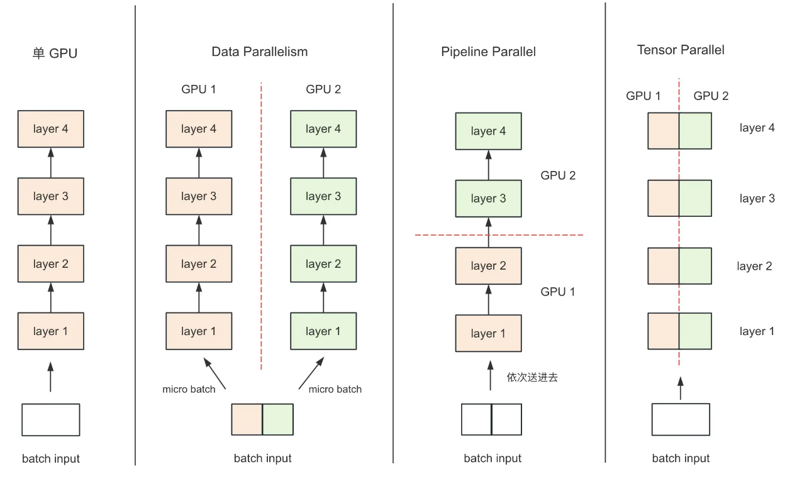
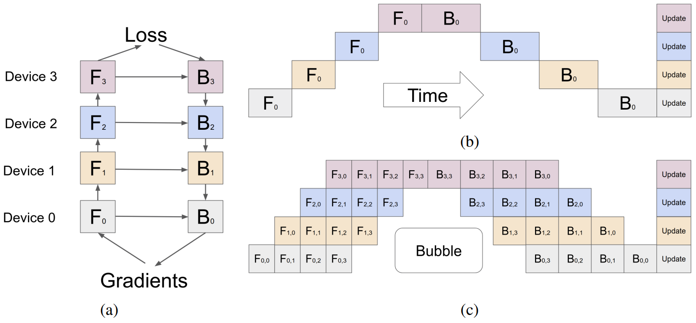

## 流水线并行

模型并行的一种策略：**把模型按层切分**，例如有 K 个 GPU 就把模型切成 K 块，每块都放到一个 GPU 上计算，通信只需要把当前层的输出张量发送给下一个层的 GPU 就好 (下图 (b))；反向传播时也只要把上面层的输出梯度发送给下面的层；参数更新是可以四个 GPU 并行完成的。

但是上面这种策略有一个很明显的问题，每个时刻都只有一个 GPU 在计算，只有参数更新是并行的，这可能只能叫做 “流水线串行”，在计算上没有节省任何时间。于是为了提升系统利用率，减少机器空闲等待时间，**流水线并行会把一个 batch 进一步拆分成 micro batch(图 (c))**，$F_{0,0}$ 表示 GPU 0 计算的 0 号 micro batch。理论上来说，机器的利用率为 $O(\frac{K-1}{M+K-1})$，其中 K 为机器数量 (模型切分块数)，M 为 micro batch 数量，只要不断增加 M，流水线效率就越高。作者在实验中发现，当 $M \geq 4K$ 时，空闲时间就对整体训练时长没有明显的影响了。

除此之外，为了进一步节省显存占用，还使用了 `re-materialization` 或者叫 `activation checkpoint` 技术。简单说就是每次计算后都把中间激活值给丢弃，每块GPU上，我们只保存来自上一块的最后一层输入 z，在反向传播需要使用中间激活的时候，就再进行一次 forward 重新计算。于是整个系统的巅峰显存占用约为 $O(N + \frac{L}{K}*\frac{N}{M})$，其中 N 为表示输入数据的大小。如何理解巅峰显存占用：首先 N 是输入数据，模型输入值肯定完整地存下来了；共有 M 个 micro batch，每个 micro batch 的梯度大小和 $\frac{N}{M}$ 成正比，然后每个 GPU 上面都有 $\frac{L}{K}$ 层模型，所以总共是 $\frac{L}{K}*\frac{N}{M}$

在使用上，流水线并行一个非常需要注意的点是：**切分要尽量保证每个机器负载均衡**，否则负载最终的那个机器会成为整个系统的瓶颈。不过对于目前主流的 Transformer 架构，是相同层堆叠起来的，每个层的计算都基本完全一致，所以切分起来非常方便，能够比较好地应用流水线并行。

更多可参考：[知乎：流水线并行 (GPipe)](https://zhuanlan.zhihu.com/p/682354879?utm_psn=1754127951723954177)

## 张量并行

很多时候会默认把张量并行叫做模型并行，有的时候要特别区分一下。我个人偏向于把张量并行归纳为模型并行的一类，因为张量并行和流水线并行都是对模型进行切分，但是切分的方位不同。张量并行是在层内进行切分，把一个完整的张量切分成若干份在不同 GPU (机器) 上计算。最有名的张量并行算法就是 Megatron，由 Nvidia 开发，仅需要在 pytorch 代码上做一些修改就可以实现，但是论文当时仅支持 Transformer 架构的模型。

**FFN/MLP 切分**

FFN 可以用式子 $Y = \sigma(xW_a)*W_b$ 来表示，显然我们的切分目标就是 $W_a\in(d,4d)$ 和 $W_b\in(4d,d)$，并且在这个式子中我们**最好先对 $W_a$ 按列切分，再对 $W_b$ 按行切分计算​** (同时按列切和同时按行切都是不行的)

* 如果先把 $W_a$ 按行拆成两个 $(\frac{d}{2}, 4d)$ 的矩阵，那么对应的 $x$ 也需要拆成两个 $(b,s,\frac{d}{2})$，于是把他们分别组合起来放到两个 GPU 上，每个 GPU 都能得到 $(b,s,4d)$ 的矩阵
  * 假如没有激活函数，那么继续把 $W_b$​ 按列切开相乘再拼接是没有问题的 (但是如果是这样做的话，先按行切相加需要 allreduce 一次，然后按列切最终还要拼接起来又要 allgather 一次，通信量更大)
  * 但是这里有激活函数，$GELU(Y)=GELU(Y_1+Y_2)!=GELU(Y_1)+GELU(Y_2)$，因此在数学上这是不等价的，必须把每个 GPU 上的 $(b,s,4d)$ 的矩阵都先加好算完 GELU 后再做乘法，这里就多了一次通信开销，先按列切就不存在这个问题。
* 如果先把 $W_a$ 按列拆成两个 $(d,2d)$ 的矩阵，那么 $x$ 就不用拆分了，每个 GPU 都要存一份，相乘得到两个 $(b,s,2d)$ 的矩阵，他们两个在列方向拼接起来就得到了我们想要的结果，但是事实上我们不需要那么快拼接， GELU 是按元素计算的，这里是拼接操作，每个位置的元素就是最终的值，所以不影响 GELU 计算。那么接下来就可以把 $W_b$ 按行拆成两个 $(2d, d)$ 的矩阵，相乘得到两个 $(b,s,d)$ 的矩阵，这时候只需要调用一次 allreduce 把他们加起来得到最终结果就好了，通讯开销就是把 $(b,s,d)$ 大小的矩阵发出去再收回来

**Self-attention**

自注意力层非常适合使用张量并行，首先对 Q、K、V 投影矩阵按列切分(其实这就是划分多个注意力头)，每一块都放到一个 GPU 上单独做自注意力 (每个 GPU 都可以有一个或多个注意力头)，然后每个 GPU 上就得到了若干个头的输出，随后再把输出矩阵 O 按行切开，放到各个 GPU 上分别相乘，就会得到 GPU 数量个 $(b,s,d)$​ 张量，运用一次 allreduce 把他们都累加起来就好了，中间计算都不需要通信，只有最后输出需要通信累加。

**所以总的来说，FFN/MLP 和 Self-attention 按上面的切分方法，在 forward / backward 阶段分别是 $2*(b,s,d)$ 大小的通信量，因此训练一次每一层都会有 $8 * (b,s,d)$ 大小的通信量** (一次 allreduce 是 2*总发送量的通讯量)

**输入层 (embeddings) 切分**

把词表 $(vocab\_size, hidden\_size)$​ 按行切分，每个 GPU 拿一部分的词表，因为输入在每个 GPU 都有一份，所以就各自查表，如果词存在词表中，就返回对应的向量；不存在就返回 0。然后每个 GPU 在做完 embedding 之后做一次 allreduce 累加各自的结果就得到了完整的正确输入嵌入。

**输出层切分**

输出是和输入共用一个 embeddings，所以输入切好了输出也就确定了，所以输出也是在 vocab_size 这个维度上切开了，不过输出用的是 (hidden_size, vocab_size) 这个方向的投影，所以这里相当于是对输出矩阵按列做切分，列切分之后相乘会得到两个 (batch_size, seq_len, vocab_size / 2) 个矩阵(以切成两份为例)，最后 allgather 起来就好了。

正常来说，我们需要对 Y1 和 Y2 做一次**All-Gather**，把它们 concat 起来形成 Y，然后对Y的每一行做 softmax，就可得到对于当前位置来说，每个词出现的概率。接着，再用此概率和真值组做 cross-entropy 即可。但是All-Gather会产生额外的通讯量 $b*s*v$​。当词表 v 很大时，这个通讯开销也不容忽视。针对这种情况，可以做如下优化：

1. 在每块 GPU 上先按行求指数和得到 (b, s) 的向量
2. 然后进行 allreduce 汇总得到完整一行的指数和，也就是 softmax 的分母部分，**此时的通讯量为 b * s**
3. 在每块GPU上，即可计算各自维护部分的 e/sum(e)，将其与真值做 cross-entropy，得到每行的 loss，按行加总起来以后得到 GPU 上 scalar Loss
4. 将GPU上的 scalar Loss 做 AllReduce，得到总 Loss，**此时通讯量为 N (N = GPU 个数)**

**张量并行一个不可避免的缺陷是网络每一层的计算都必须等待前面那层做完 allreduce 才能继续算，计算和通讯没法并行。**

更多可参考：[知乎：张量并行](https://zhuanlan.zhihu.com/p/622212228)

### 为什么 ZeRO 也会对模型参数进行切分，但是却叫做数据并行

**ZeRO是模型并行的形式，数据并行的实质**。
模型并行，是指在 forward 和 backward 的过程中，我只需要用自己维护的那块 W 来计算就行。即**同样的输入 X，每块 GPU 上各算模型的一部分，最后通过某些方式聚合结果**。
但对 ZeRO 来说，它做 forward 和 backward 的时候，是需要把各 GPU 上维护的 W 聚合起来的，即本质上还是用完整的 W 进行计算。**它是不同的输入 X，完整的参数 W，最终再做聚合**。