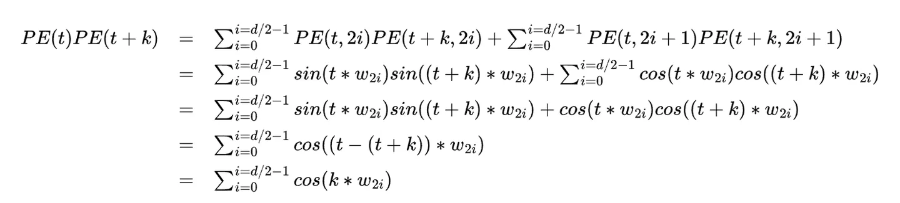
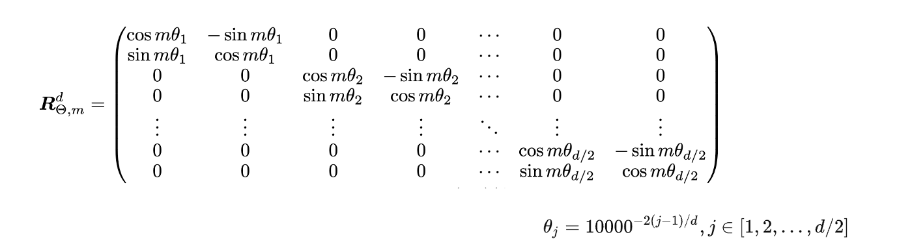
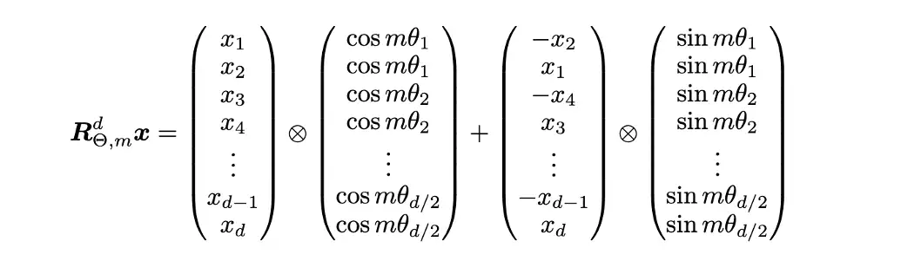
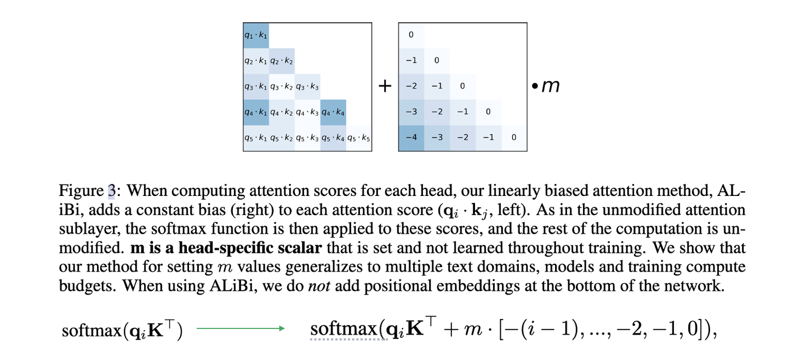

# 位置编码

>不同于RNN、CNN等模型，对于Transformer模型来说，位置编码的加入是必不可少的，因为纯粹的Attention模块是无法捕捉输入顺序的，即无法区分不同位置的Token。为此我们大体有两个选择：1、想办法将位置信息融入到输入中，这构成了绝对位置编码的一般做法；2、想办法微调一下Attention结构，使得它有能力分辨不同位置的Token，这构成了相对位置编码的一般做法。

[绝对位置编码和相对位置编码归纳](https://kexue.fm/archives/8130)

> 一般来说，绝对位置编码具有实现简单、计算速度快等优点，而相对位置编码则直接地体现了相对位置信号，跟我们的直观理解吻合，实际性能往往也更好。由此可见，如果可以通过绝对位置编码的方式实现相对位置编码，那么就是“集各家之所长”、“鱼与熊掌兼得”了。Sinusoidal位置编码隐约做到了这一点，但并不够好。旋转式位置编码（Rotary Position Embedding，RoPE）是一种配合Attention机制能达到“绝对位置编码的方式实现相对位置编码”的设计。而也正因为这种设计，它还是目前唯一一种可用于线性 Attention 的相对位置编码。
>
> [线性 Attention](https://kexue.fm/archives/7546)：$softmax(QK^T)V$ => 这个计算复杂度是 $O(n^2)$ 的，一个最简单的线性化方法就是去掉 softmax => $QK^TV$，由于矩阵乘法是满足结合率的，所以我们可以先算 $K^TV$，得到一个 $d*d$ 的矩阵，然后用 $Q$ 左乘它，由于 $d\ll n$，所以这样算的复杂度只是 $O(n)$​
>
> RoPE是目前唯一一种可以用于线性Attention的相对位置编码。这是因为其他的相对位置编码，都是直接基于Attention矩阵进行操作的，但是线性Attention并没有事先算出Attention矩阵，因此也就不存在操作Attention矩阵的做法，所以其他的方案无法应用到线性Attention中。而对于RoPE来说，它是用绝对位置编码的方式来实现相对位置编码，不需要操作Attention矩阵，因此有了应用到线性Attention的可能性。


**Sinusoidal 位置编码可以表示相对位置吗? 为什么还需要相对位置编码**



Sinusoidal 位置编码其实可以表示相对位置: $P(i + k)$ 可以由 $P(i)$ 线性表示; $P(i + k) * P(i)$ 的结果最终是一个关于 k 的常数, 同时 $P(i + k) * P(i) = P(i - k) * P(i)$, 这表明 Sinusoidal 位置编码具有对称性, 同时还能发现, 随着 k 的增加, 点积的结果会逐渐减小, 存在**远程衰减**特性

这么看来 Sinusoidal 位置编码几乎能满足我们的所有要求, 但是实际的 attention 计算需要和 $W_Q, W_K$相乘 => $P(t)^TW_Q^TP(t+k)W_k$, 这时候的点积结果就不能反映距离了


## 旋转位置编码



对于第 m 个 token 的 d 个特征, 两两分组进行"旋转", 上图就是纯粹的位置表示, 实现的时候可以事先处理好这个矩阵, 然后再和 q k 相乘, 就注入了位置信息

不过上面的位置矩阵非常的稀疏, 按矩阵乘法规则展开之后, 就可以发现矩阵相乘可以转换成相加的操作:



这样也给我们实现代码带来了很大的便利, 同理我们可以事先处理好位置信息, 然后再和表征相乘就好了, 下面给出 llama 的旋转位置编码实现

1. 旋转角度计算

```python
# base: 就是上面图中 $\theta_j$ 的底数, 默认为 10000 (这也叫做 rope 的基频)
# dim: 每个 attention head 的 head_dim = hidden_dim // num_heads
# 因为把特征维度两两分组, 所以这里步长为 2, 最终的维度就是 [dim // 2]
inv_freq = 1.0 / (self.base ** (torch.arange(0, self.dim, 2).float().to(device) / self.dim))
# 注册之后就可以通过 self 访问, 同时更重要的是 register_buffer 会将这个 tensor 写入 buffer 区, 表示一个常量, 没有梯度, 同时会出现在 named_parameters() 中
self.register_buffer("inv_freq", inv_freq, persistent=False)
```

2. 计算 cos sin 矩阵

```python
@torch.no_grad()
def forward(self, x, position_ids):
    # x: [bs, num_attention_heads, seq_len, head_size]
    # None index 的作用和 unsqueeze() 对应维度的效果是一样的, 就是在 None 位置添加一个维度
    # [1, dim // 2, 1]
    inv_freq_expanded = self.inv_freq[None, :, None].float().expand(position_ids.shape[0], -1, 1)
    # [1, 1, seq_length]
    position_ids_expanded = position_ids[:, None, :].float()
    # Force float32 since bfloat16 loses precision on long contexts
    # See https://github.com/huggingface/transformers/pull/29285
    device_type = x.device.type
    device_type = device_type if isinstance(device_type, str) and device_type != "mps" else "cpu"
    with torch.autocast(device_type=device_type, enabled=False):
        # [1, seq_length, dim // 2]
        freqs = (inv_freq_expanded.float() @ position_ids_expanded.float()).transpose(1, 2)
        # 因为特征维度两两分组, 所以直接在最后一维 concat => [0, dim // 2] ... [dim // 2 - 1, dim - 1] 是一组 => 这样做非常方便后面的实现
        emb = torch.cat((freqs, freqs), dim=-1)
        # 根据上面的图, 最终是和一个 cos 矩阵相乘再和 sin 矩阵相乘然后相加就好了, 这里就分别处理得到 sin cos 矩阵
        cos = emb.cos()
        sin = emb.sin()
    return cos.to(dtype=x.dtype), sin.to(dtype=x.dtype)
```

3. 应用旋转位置编码

```python
def rotate_half(x):
    """Rotates half the hidden dims of the input."""
    # 上面说了, [0, dim // 2] ... [dim // 2 - 1, dim - 1] 是一组, 所以这里取出的 x1 x2 彼此恰好就是一组旋转变量
    # x1 对应的是第 0 2 4 6 ... 个位置的特征, 和特征相乘后符号为正
    # x2 对应的是第 1 3 5 7 ... 个位置的特征, 和特征相乘后符号为负
    x1 = x[..., : x.shape[-1] // 2]
    x2 = x[..., x.shape[-1] // 2 :]
    return torch.cat((-x2, x1), dim=-1)


def apply_rotary_pos_emb(q, k, cos, sin, position_ids=None, unsqueeze_dim=1):
    """Applies Rotary Position Embedding to the query and key tensors.

    Args:
        q (`torch.Tensor`): The query tensor.
        k (`torch.Tensor`): The key tensor.
        cos (`torch.Tensor`): The cosine part of the rotary embedding.
        sin (`torch.Tensor`): The sine part of the rotary embedding.
        position_ids (`torch.Tensor`, *optional*):
            Deprecated and unused.
        unsqueeze_dim (`int`, *optional*, defaults to 1):
            The 'unsqueeze_dim' argument specifies the dimension along which to unsqueeze cos[position_ids] and
            sin[position_ids] so that they can be properly broadcasted to the dimensions of q and k. For example, note
            that cos[position_ids] and sin[position_ids] have the shape [batch_size, seq_len, head_dim]. Then, if q and
            k have the shape [batch_size, heads, seq_len, head_dim], then setting unsqueeze_dim=1 makes
            cos[position_ids] and sin[position_ids] broadcastable to the shapes of q and k. Similarly, if q and k have
            the shape [batch_size, seq_len, heads, head_dim], then set unsqueeze_dim=2.
    Returns:
        `tuple(torch.Tensor)` comprising of the query and key tensors rotated using the Rotary Position Embedding.
    """
    # unsqueeze 方便在多个注意力头之间广播
    cos = cos.unsqueeze(unsqueeze_dim)
    sin = sin.unsqueeze(unsqueeze_dim)
    # 这里就对应了 cos 矩阵相乘再和 sin 矩阵相乘再相加的计算
    q_embed = (q * cos) + (rotate_half(q) * sin)
    k_embed = (k * cos) + (rotate_half(k) * sin)
    return q_embed, k_embed
```

**为什么如今大部分LLM的位置编码都选择了RoPE？**

> 1. RoPE 不带有显式的远程衰减，这对于旨在 Long Context 的模型至关重要
>
> 2. RoPE 是一种真正的位置编码，通过不同频率的三角函数有效区分了长程和短程，达到了类似层次位置编码的效果，这也是 Long Context 中比较关键的一环
> 
> 3. RoPE直接作用于Q、K，不改变Attention的形式，与 Flash Attention 更契合，更容易 Scale Up。

> 相比之下，诸如 ALIBI、KERPLE 等，虽然有时也称为位置编码，但它们实际上只是一种 Attention Bias，没有太多位置信息，且不适用于 Encoder，能用于 Decoder 大体上是因为 Decoder 本身的下三角 Mask 就已经有较为充分的位置 Bias 了，额外的 Attention Bias 只是锦上添花。此外它们无法在单个头内有效区分长程和短程，而是要通过在不同头设置不同的 Decay 因子来实现，这也意味着它们用于单头注意力（比如 GAU）的效果会欠佳。

## ALiBi



Attention with Linear Biases (ALiBi) 是一种专门提高 transformer 模型外推能力的编码，让模型在训练阶段的上下文不是很长，但是在预测阶段可以支持很长的上下文。

具体而言，在attention计算之后，会添加一个固定的偏置项，这个偏置项是固定的(不需学习)，只跟相对位置有关。对于 attention score 会根据距离添加“惩罚”，距离越大，惩罚也越大。不同的 attention head 施加的惩罚系数m不同。具体而言，假设一共有 n 个 head，系数 m 是一个等比数列，始于 $2^{-8/n}$, 终于 $2^{-8}$。 这是作者实验之后得到的经验值。

# 长度外推

[外推介绍](https://kexue.fm/archives/9431)
[Transformer升级之路：16、“复盘”长度外推技术](https://spaces.ac.cn/archives/9948)

**定义:** “Train Short, Test Long”。(外推也分为训练外推/免训练外推, 免训练外推就是不需要用长序列数据进行额外的训练，只用短序列语料对模型进行训练，就可以得到一个能够处理和预测长序列的模型)

**挑战:** 长度外推性是一个训练和预测的长度不一致，不一致具体体现为两个方面: 1. 预测的时候用到了没训练过的位置编码（不管绝对还是相对）；2. 预测的时候注意力机制所处理的token数量远超训练时的数量 (会导致注意力分数更加分散)

**如何判断一个模型能否用于长序列:** 最基本的指标就是模型的长序列 Loss 或者 PPL 不会爆炸，更加符合实践的评测则是输入足够长的 Context，让模型去预测答案，然后跟真实答案做对比，算 BLEU、ROUGE 等，LongBench 就是就属于这类榜单

## 常用技术手段

### 窗口截断

滑动窗口 or $\lambda$-滑动窗口 (就是像 h2o, streamingllm 那样保留前 k 个 tokens) 的滑窗

**为什么开头的Token会占据如此重要的地位呢？**
> 1. 开头的几个 Token 是绝对位置的“锚点”：顾名思义，相对位置编码原则上只能识别相对位置，但有些任务可能比较依赖绝对位置，通过开头几个绝对位置约等于 0 的 Token 作为“标的”，每个 Token 就能够测出自己的绝对位置，而去掉开头几个 Token 后则缺失了这一环，从而完全打乱了注意力模式导致 PPL 爆炸；
>
> 2. 开头的几个 Token 是注意力的“回收站”：由于注意力求和为 1，所以注意力一定会分配到某些 Token 上，但有些情况下模型可能会发现“没什么 Token 值得注意的”，这时它选择将一部分注意力放到没什么信息量的前几个 Token 上，起到“不注意”的作用，去掉它们后模型会强行将注意力分配到其他无关的 Token，从而扰乱了注意力模式。

从实验观测角度来看, 就是前几个 token 的注意分数占比非常高, 不能去掉, 去掉注意力就全乱了


### 位置内插

相对位置的 OOD，直接表现就是预测阶段的相对位置超出了训练时的范围，由于没有被训练过，“越界”部分的行为无法预估。那一个简单的方法就是把预测长文本的位置都乘以一个缩放系数 $\frac{L_{train}}{L_{test}}$, 直接把所有位置都缩放到训练的长度范围内:

$$
\begin{equation}\begin{aligned}&\text{训练阶段}:\,(1,2,\cdots,n-1,n)\\[5pt] 
&\text{预测阶段}:\,(1,2,\cdots,n,\underbrace{n+1,\cdots,4n-1,4n}_{\text{远处越界}})\xrightarrow{\quad\text{内插}\quad} 
\big(\underbrace{\frac{1}{4},\frac{2}{4},\frac{3}{4}}_{\text{局部失真}},\cdots,n-\frac{1}{4},n\big)\end{aligned}\end{equation}
$$

> 然而，位置内插并不算长度外推方案，至少不是免训练的长度外推方案，因为位置内插之后同样会有PPL爆炸的问题。原因也不难理解，尽管位置内插避免了远处的位置越界问题，但这同时压缩了邻近 Token 的距离(由于位置 id 是整数, 所以可能位置 i, i + 1, i + 2, ..., i + k 乘以缩放因子后都变成了 j, 这就区分不了距离了)，严重扰乱了模型的局部分辨率，而众所周知语言模型本身就是一个非常依赖于局部关系的任务，所以扰乱了局部自然就没法预测准了。
> 
> 不过，这也并非说位置内插就没有价值了。我们知道，需要长度外推的读者，无外乎是两种情况：一种是没有资源去做长文本微调，希望能够从短文本模型直接得到一个可用的长文本模型，这种需求对长度外推的效果要求会比较高，位置内插就不适合他们了；另一种是有资源去做长文本微调，研究长度外推纯粹是为了得到一个更好的初始化模型，这种情况对模型修改带来的初始损失容忍度比较高，只要能够通过微调快速弥补回损失掉的效果即可，位置内插正好是属于此类方法。Meta 的论文显示，经过 PI 之后，仅需 1000 步左右的长文本训练，就可以得到一个行之有效的长文本模型，这比不做任何修改直接微调的训练效率高出很多。

当然上面的方法也有一个很直接的优化思路, 直接外推有远处越界的问题, 而位置内插的问题是局部失真, 因此实现免训练长度的外推要领应该是"保证局部不失真"&&"压缩远处不越界", 因此一个很直接的想法就出现了, 规定一个窗口大小 w, 把相对位置分成了两部分, 在窗口内不改变相对位置实现"局部不失真", 在窗口外使用位置内插实现 "远处不越界" => Leaky ReRoPE, 上述的缺点就是实现比较麻烦: Leaky ReRoPE 和 ReRoPE 的相对位置是分段线性的，这意味着朴素地实现的话，需要算两次 Attention 矩阵（得到两段不同的线性）然后将它们拼接起来，这样效率无疑明显降低了 => 但是好处是目前主流的 attention 加速手段 flashattention 是分块计算的, 只有窗口边界附近的块才需要计算两次 attention, 其余都只要计算一次, 当序列很长的时候大部分块都是不需要计算两次的