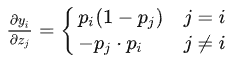

**为什么 attention $QK^T$ 要除以 $\sqrt{d_k}$**

1. 将 $QK^T$ 标准化, 转换成均值为 0 方差为 1 的分布 [原因](https://blog.csdn.net/tailonh/article/details/120544719)
2. 防止 softmax 的输入过大, 导致对应位置的偏导数过小 [softmax 求导](https://www.cnblogs.com/hisi-tech/p/16709612.html)

**MSE和交叉熵的区别**

**top-k 和 beam search 的区别**

1. beam search 能够生成多条结果; top-k 只能生成单条结果 (仅使用 top-k)
2. beam search 目的是生成全局更优的序列, 避免贪婪陷入局部最优; top-k 的目的是向序列中引入更多随机性, 更具创造力
3. beam search 复杂度更高, 因为要维护 k 条解码序列

**为什么现在的 LLM 都是 Decoder-only 的架构？**

首先需要明确这个问题的背景是生成任务的场景:
1. Decoder-only 的模型训练效率和工程实现上有优势 => 预训练是 next token prediction, 非常完美的自监督训练数据
2. 在生成场景下双向注意力没有带来收益，可能是因为双向注意力的低秩问题导致效果下降 (因为 attention 矩阵由两个 $n*d$ $d*n$ 的低秩矩阵相乘得到, d = hidden_size // head_num, 因此通常 $n >> d$, 相乘之后很可能就不满秩; 而 Decoder-only 架构的 Attention 矩阵是一个下三角阵，注意三角阵的行列式等于它对角线元素之积，由于softmax 的存在，对角线必然都是正数，所以它的行列式必然是正数，即 Decoder-only 架构的 Attention 矩阵一定是满秩的！满秩意味着理论上有更强的表达能力，也就是说，Decoder-only 架构的 Attention 矩阵在理论上具有更强的表达能力，改为双向注意力反而会变得不足) (Encoder-Decoder架构的优势很可能只是源于参数翻倍)

**如何解决模型复读机问题**

出现原因:
1. 数据原因 => 预训练数据中包含大量重复文本, 某种重复的模式或者多样性不高
2. induction heads (归纳头现象) => 模型会倾向于从前面已经预测的 word 里面挑选最匹配的词

解决方案:
1. 基于训练的方法: 构造伪数据，即短语重复、句子重复等伪数据，如短语或句子重复 N 遍，然后设计重复惩罚项来抑制大模型生成重复句子
2. 基于解码的方法: 1. beam search 生成多个序列 2. top-k top-p 采样使得有更多 tokens 有机会被选择, 增加随机性 3. 惩罚因子向已经生成的词添加惩罚, 降低模型生成已经生成过的词的可能性

**为什么 bert 需要微调**

BERT 的预训练任务是 MLM, 虽然通过 MLM BERT 学习到了语言的理解能力, 但是从任务形式上来看仅擅长还原 mask, 而真实的下游任务通常都不会出现 mask, 这就导致下游任务形式和预训练形式存在 gap, 为了补齐这个 gap 需要构造微调数据使得模型适配不同的下游任务

这个问题也并不意味着 
1. bert 不微调就用不了 => 一些 prompt-template based 的方法就是通过设计包含 mask 的任务模板, 调整下游任务形式来弥补 gap
2. gpt like 就一定不用微调 => 指令微调就是一个很好的例子, 能够使得语言模型具备理解指令, 适配各种下游任务的能力

**为什么需要注意力机制需要多个注意力头**

多头注意力机制能够捕获输入序列中的多种不同特征和模式，从而增强模型的表达能力和泛化能力; (例如单词在不同语境下具有不同含义, 多个头能够独立学习各种语义信息; 在文本中有些头可能更关注到语法结构, 有些头可能更关注到语义信息和上下文信息等等)

**From MHA -> MQA -> GQA -> MLA**

[苏神博客](https://spaces.ac.cn/archives/10091)

MLA (Multi-head Latent Attention) -> 两种理解角度:
1. 低秩分解 -> 因为 MLA 的核心操作就是把 kv 投影矩阵 $W_k W_v$ 的输入换成了 $c = x_iW_c, W_c\in R^{d*d_c}$ (最初想法, 实现上为了兼容 ROPE 还会对 q 的也实施低秩投影)
2. 进一步增强 GQA 的表达能力 -> 仔细想想其实 GQA 也相当于做了低秩分解, 如果把所有的 kv 都在最后一个维度上拼接起来, 那么 GQA 的 kv 总长度为 $g(d_k+d_v)$, 其中 g 为分组数量, 相当于把注意力头数 h 投影到了 g, 这也是低秩分解。GQA 为了凑齐 h 个头采用复制的方式, 但是复制是非常简单的线性变换, **所以MLA的第一个想法是将这些简单的线性变换换成一般的线性变换，以增强模型的能力** => 具体做法是, 保留 h 个不同的投影矩阵, 把输入变成一样的:

$$
\begin{equation} 
\begin{gathered} 
\boldsymbol{o}_t = \left[\boldsymbol{o}_t^{(1)}, \boldsymbol{o}_t^{(2)}, \cdots, \boldsymbol{o}_t^{(h)}\right] \\[10pt] 
\boldsymbol{o}_t^{(s)} = Attention\left(\boldsymbol{q}_t^{(s)}, \boldsymbol{k}_{\leq t}^{(s)} ,\boldsymbol{v}_{\leq t}^{(s)}\right)\triangleq\frac{\sum_{i\leq t}\exp\left(\boldsymbol{q}_t^{(s)} \boldsymbol{k}_i^{(s)}{}^{\top}\right)\boldsymbol{v}_i^{(s)}}{\sum_{i\leq t}\exp\left(\boldsymbol{q}_t^{(s)} \boldsymbol{k}_i^{(s)}{}^{\top}\right)} \\[15pt] 
\boldsymbol{q}_i^{(s)} = \boldsymbol{x}_i\boldsymbol{W}_q^{(s)}\in\mathbb{R}^{d_k},\quad \boldsymbol{W}_q^{(s)}\in\mathbb{R}^{d\times d_k}\\ 
\boldsymbol{k}_i^{(s)} = \boldsymbol{c}_i\boldsymbol{W}_k^{(s)}\in\mathbb{R}^{d_k},\quad \boldsymbol{W}_k^{(s)}\in\mathbb{R}^{d_c\times d_k} \\ 
\boldsymbol{v}_i^{(s)} = \boldsymbol{c}_i\boldsymbol{W}_v^{(s)}\in\mathbb{R}^{d_v},\quad \boldsymbol{W}_v^{(s)}\in\mathbb{R}^{d_c\times d_v} \\[10pt] 
\boldsymbol{c}_i = \boldsymbol{x}_i \boldsymbol{W}_c\in\mathbb{R}^{d_c},\quad \boldsymbol{W}_c\in\mathbb{R}^{d\times d_c} 
\end{gathered} 
\end{equation}
$$

这里需要特别注意, 我们使用 GQA 和 MLA 的目的都是节省 kv cache, 而 MLA 的这个做法，通过不同的投影矩阵再次让所有的 K、V Head 都变得各不相同，那么 KV Cache 的大小就恢复成跟 MHA 一样大了，违背了 GQA 的初衷。因此**仅在推理阶段**用了一个简单的变换:
$$
\begin{equation}\boldsymbol{q}_t^{(s)} \boldsymbol{k}_i^{(s)}{}^{\top} = \left(\boldsymbol{x}_t\boldsymbol{W}_q^{(s)}\right) \left(\boldsymbol{c}_i\boldsymbol{W}_k^{(s)}\right){}^{\top} = \boldsymbol{x}_t\left(\boldsymbol{W}_q^{(s)}\boldsymbol{W}_k^{(s)}{}^{\top}\right)\boldsymbol{c}_i^{\top} \end{equation}
$$
因此就可以把 $W_q^{(s)}W_k^{(s)T}$ 合并起来作为 Q 的投影矩阵, 仅仅需要保存 $c_i$ 就取代原来的 $k_i$, 同理，在 $o_t$ 后面我们还有一个投影矩阵，于是 $v^{(s)}_i=c_iW^{(s)}_v$ 的 $W^{(s)}_v$ 也可以吸收到后面的投影矩阵中去，于是等效地 $v_i$ 也可以用 $c_i$ 代替。注意到 $c_i$ 跟(s) 无关，也就是说是所有头共享的，即 MLA 在推理阶段它可以恒等变换为一个 MQA

> （注：这里有一个细节，就是 $W_q^{(s)}W_k^{(s)T}$ 合并成一个矩阵的恒等变换，理论上只有在无限精度下才成立，实际上如果我们使用单精度尤其是BF16的话，经过变换后的精度损失往往还是挺明显的，经过多层累积后可能放大到比较可观的程度，这里可能要根据实际误差看要不要做一些后处理）

**MLA 和 ROPE 不兼容怎么办**

首先明确一点, 不兼容指的是如果 MLA 应用了 ROPE 在推理阶段就不能节省 kv cache 了, 因为 ROPE 使用就是分别在获得 q k 向量时乘上一个旋转矩阵, 然后在计算 $qk^T$ 的时候中间会多一个表示想对位置的矩阵 $R_{i-j}$, 而 MLA 推理阶段想要省显存就必须事先合并矩阵, 而使用 ROPE 后中间多了一个和位置相关的矩阵显然无法事先合并了

**解决方案:**

1. 把 q 也进行低秩投影, 然后把 ROPE 加在 c_i 后, 这样 $R_i$ 就可以吸收到 $c_i$ 中去，但这样就没有 $R_mR^⊤_n=R_{m−n}$ 的运算了，此时的 RoPE 不再是通过绝对位置实现相对位置，而单纯是在 Q、K 上加绝对位置，让模型自己想办法提炼相对位置信息
2. 最后发布的 MLA，采取了一种混合的方法——每个 Attention Head 的 Q、K 新增 $d_r$ 个维度用来添加 RoPE(不是单纯增加 $d_r$ 个维度, 这部分是应用了旋转的)，其中 K 新增的维度每个 Head 共享 => 新增的带RoPE的维度就可以用来补充位置信息

## 机器学习相关

**决策树剪枝基本策略:**

预剪枝(pre-pruning): 在决策树生成过程中，对每个节点在分割前先进行估计。若当前的分割不能带来决策树泛化性能的提升，则停止分割并将当前节点标记为叶节点。在预剪枝过程中，决策树的很多分支都没有展开，这不仅降低了过拟合的风险，还显著减少了决策树的训练时间和预测时间；但有些分支的当前分割虽不能提升泛化性能、甚至能导致泛化性能下降，但在其基础上的后续分割却有可能导致泛化性能的显著提高，容易导致欠拟合

后剪枝(post-purning): 先从训练样本集生成一棵最大规模的完整的决策树，然后自底向上地对非叶结点进行考察。若将该提升决策树的泛化性能，则将该子树替换为叶节点节点对应的子树替换为叶节点。后剪枝决策树比预剪枝决策树保留了更多的分支。后剪枝过程的欠拟合风险很小，泛化性能往往优于预剪枝决策树，但后剪枝过程是在生成完全决策树之后进行的，并且要自底向上地对树中所有的非叶节点进行逐一考察，因此训练时间开销比未剪枝决策树和预剪枝决策树都要大的多

**AUC&ROC**

ROC 是不同分类阈值下的真正类率(y 轴)和假正类率(x 轴)构成的曲线, 其中

* 真正类率就是 recall (预测正确的正类数 / 真实正类数) => 越高越好
* 假正类率 = 预测错误的正类数 / 真实负类数 => 越低越好

优点:
1. 便于选择分类阈值, ROC 曲线越靠近左上方, 分类性能越好
2. 便于比较不同的分类器, 直接把两个分类器的 ROC 曲线绘制在一个坐标系下比较
缺点:
1. ROC 曲线发生交叉比较难判断分类器优劣

AUC 指的是 ROC 曲线下的面积, 面积越大, 综合分类性能越好, 计算方法有两种:
1. 按定义计算曲线下的面积 => 积分, 选取一定的划分间隔, 然后累加每个小块的面积
2. 通过分布函数可以推导出另一个物理意义 => 枚举所有 <真实正例, 真实负例> 对, (真实正例预测概率 > 真实负例预测概率) 的概率

针对第二个定义有两种计算方法:
1. 从 label 中把正负样本分开, 然后枚举正负样本对, 若正样本预测概率 > 负样本预测概率, auc += 1; 正样本预测概率 = 负样本预测概率, auc += 0.5; 正样本预测概率 < 负样本预测概率, auc + 0, 然后最后 auc = auc / (正样本数 * 负样本数) (时间复杂度 O(m * n), m n 分别为正负样本数)
2. 把预测概率从小到大升序排列 (argsort), 然后从左往后枚举每个预测样本, 若 label[i] == 0 -> neg_cnt += 1; 若 label[i] == 1 -> cur += neg_cnt (累计负样本数, 因为排序后第 i 个样本的概率大于 i 之前的所有样本 => 但是这样无法考虑到预测概率相等的情况)