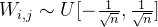
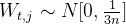
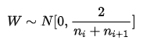
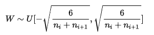

**参数初始化**又称为**权重初始化**（weight initialization）或**权值初始化**。深度学习模型训练过程的本质是对weight（即参数 W）进行更新，这需要每个参数有相应的初始值。说白了，神经网络其实就是对权重参数w不停地迭代更新，以达到较好的性能。

模型权重的初始化对于网络的训练很重要，不好的初始化参数会导致梯度传播问题，降低训练速度；而好的初始化参数能够加速收敛，并且更可能找到较优解。如果权重一开始很小，信号到达最后也会很小；如果权重一开始很大，信号到达最后也会很大。


初始化方法列举：https://zhuanlan.zhihu.com/p/72374385

## Xavier 初始化

https://blog.csdn.net/xian0710830114/article/details/125540678

https://zhuanlan.zhihu.com/p/513656676

**核心思想：**优秀的初始化应该使得各层的激活值、状态以及梯度的方差在传播过程中保持一致

**具体做法：**在标准初始化方法的基础上，兼顾了各层在前向传播和反向传播时的参数方差

标准初始化方法的均一分布和高斯分布形式 (二者等价)：





Xavier 初始化的均一分布和高斯分布形式 (二者等价)：





```python
# 均一分布形式
torch.nn.init.xavier_uniform_(tensor, gain=1.0, generator=None)
# 高斯分布形式
torch.nn.init.xavier_normal_(tensor, gain=1.0, generator=None)
```

但是 Xavier 初始化对激活函数做出了假设：

1. 激活函数是对称的 (以 0 对称) => 这样可以确保每一层的输入均值都是 0 (例如 tanh)
2. 激活函数在 0 处的导数为 1

因此 Xavier 初始化事实上并不适用于 sigmoid、relu 激活函数，因为除了第一层的输入符合要求外，后续层的输入都被激活函数映射到了正数的区间。(其实用 sigmoid 还好，用 relu 就尤为明显，因为在均值为 0 的假设下，每层神经元只有一半会被激活，模型越深，深层的激活会越来越接近 0)

## Kaiming 初始化

核心思想：在 ReLU 网络中，假定每一层有一半的神经元被激活，另一半为 0 (x 负半轴中是不激活的)，**所以要保持 variance 不变，只需要在 Xavier 的基础上再除以 2**，同时仅考虑输入或输出的维度，不需要像 Xavier 一样把同时考虑输入输出维度，二者任选其一就好了

```python
# 均一分布形式
torch.nn.init.kaiming_uniform_(tensor, a=0, mode='fan_in', nonlinearity='leaky_relu', generator=None)
# 高斯分布形式
torch.nn.init.kaiming_normal_(tensor, a=0, mode='fan_in', nonlinearity='leaky_relu', generator=None)
```


>  尽管Xavier初始化能够在Sigmoid和tanh激活函数叠加的神经网络中起到一定的效果，但由于ReLU激活函数属于非饱和类激活函数，并不会出现类似Sigmoid和tanh激活函数使用过程中可能存在的梯度消失或梯度爆炸问题，反而因为ReLU激活函数的不饱和特性，ReLU激活函数的叠加极有可能出现神经元活性消失的问题，很明显，该类问题无法通过Xavier初始化解决。
>
> 尽管如此，对参数的初始值进行合理设置，仍然是保证模型有效性的有效方法，同样也能一定程度上解决ReLU激活函数的神经元活性消失问题。目前通用的针对ReLU激活函数的初始化参数方法，是由何凯明在2015年的《Delving Deep into Rectifiers: Surpassing Human-Level Performance on ImageNet Classification》一文中所提出的HE初始化方法，也被称为Kaiming方法。
>
> 当然，He 初始化也遵循 Glorot 条件，即参数初始化结果要求正向传播时各层接收到的数据方差保持一致、反向传播时各层参数梯度的方差保持一致，不过由于每一层的激活值（激活函数输出结果）均值不为 0，因此 Xavier 的数学推导过程不再成立。需要知道的是，经过一系列的推导和论证之后，HE 初始化仍然是规定参数是满足均值为0的随机变量，并且仍然借助均匀分布和高斯分布进行随机变量创建，不同的是 Xavier 中参数方差为：
> $$
> Var(w)_{HE} = \frac{2}{f_{in}} \quad or \quad Var(w)_{HE} = \frac{2}{f_{out}}
> $$
> 对应的均一分布区间即为：
> $$
> [-\sqrt{\frac{6}{f_{in}}}, \sqrt{\frac{6}{f_{in}}}]
> $$
> https://blog.csdn.net/weixin_43186779/article/details/136895401


