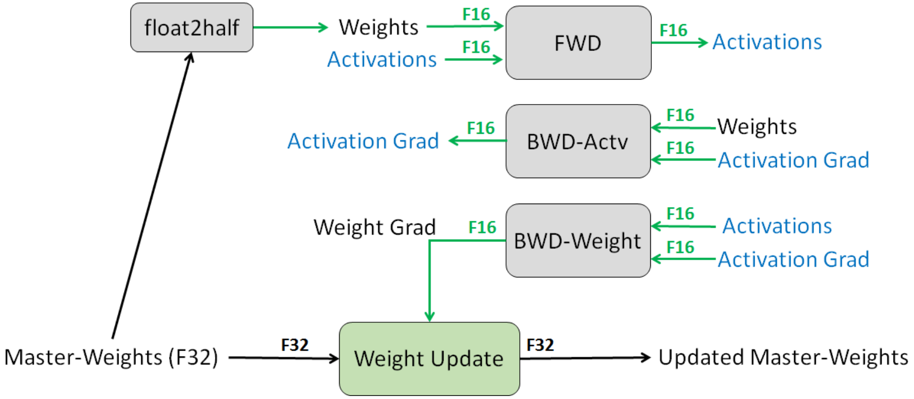

# 分析 transformer 模型的参数量、计算量、中间激活、KV cache

> 学习记录：https://zhuanlan.zhihu.com/p/624740065
>
> 最近，OpenAI推出的ChatGPT展现出了卓越的性能，引发了大规模语言模型(Large Language Model, LLM)的研究热潮。大规模语言模型的“大”体现在两个方面：模型参数规模大，训练数据规模大。以GPT3为例，GPT3的参数量为1750亿，训练数据量达到了570GB。进而，训练大规模语言模型面临两个主要挑战：**显存效率**和**计算效率**。

**后向传递的计算量是前向传递的2倍** => 主要是由于后向计算多了一倍 loss 对每一层输出的**激活值**求微分/导数/梯度的计算量

## 混合精度训练

### 基本思想和具体细节

[MIXED PRECISION TRAINING](https://arxiv.org/pdf/1710.03740.pdf)

**Automatic Mixed Precision (AMP)** 是一种自动混合使用半精度（FP16）和单精度（FP32）来加速模型训练的技术。现代加速器使用 16 位 dtype 执行运算的速度更快，因为它们有执行 16 位计算的专用硬件，并且从内存中读取 16 位 dtype 的速度也更快。AMP 技术可方便用户快速将使用 FP32 训练的模型修改为使用混合精度训练，并通过黑白名单和动态`loss scaling`来保证训练时的数值稳定性进而避免梯度 Infinite 或者 NaN(Not a Number) (主要是防止训练后期梯度过小出现下溢现象)。

* **核心思想**：通过让模型的某些部分保持使用 32 位类型以保持数值稳定性，可以缩短模型的单步用时，而在评估指标（如准确率）方面仍可以获得同等的训练效果。
* **核心优势：**1. 内存占用更少。2. 计算更快。

其他所有值（weights，activations， gradients）均使用 fp16 来存储，而唯独权重 weights 需要用 fp32 的格式额外备份一次。 这主要是因为，在更新权重的时候，往往公式: **权重 = 旧权重 + lr \* 梯度**，而在深度模型中，**lr \* 梯度** 这个值往往是非常小的，如果利用 fp16 来进行相加的话， 则很可能会出现`舍入误差`问题，导致更新无效。因此将 weights 拷贝成 fp32 格式，并且确保整个更新（update）过程是在 fp32 格式下进行的。

虽然拷贝一份 fp32 的权重增加了一份显存占用，但是训练过程中，内存中占据大部分的基本都是 activations 的值，特别是在 batch size 很大的情况下，因此只要 activation 的值使用 fp16 来进行存储，最终模型与 fp32 相比起来，内存占用也基本能够减半。

### 半精度浮点类型

半精度（Float Precision16，FP16）是一种相对较新的浮点类型，在计算机中使用 2 字节（16 位）存储。在 IEEE 754-2008 标准中，它亦被称作 binary16。与计算中常用的单精度（FP32）和双精度（FP64）类型相比，FP16 更适于在精度要求不高的场景中使用。

$$
float16 = (-1)^{signbit}*2^{(exponent-15)}*(1+\frac{fraction}{1024})
$$

>**float16 和 bfloat16 的区别：**
>
>* bfloat16 格式使用 16 位表示浮点数，其中 1 位用于符号，8 位用于指数，7 位用于尾数。
>
>* float16 格式使用 16 位表示浮点数，其中 1 位用于符号，5 位用于指数，10 位用于尾数。
>
>bfloat16 的表示范围比 float16 更广，但是精度更低
>