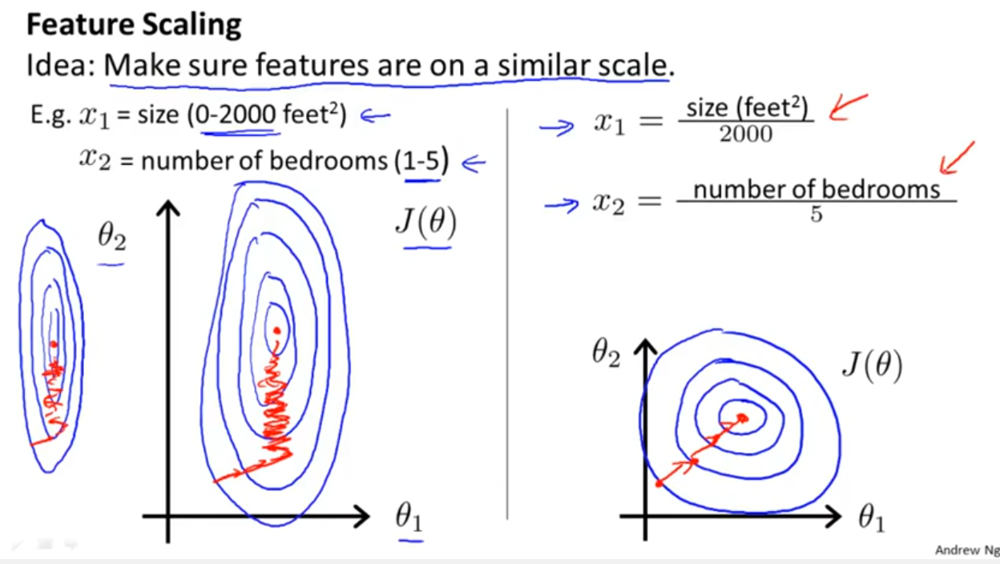
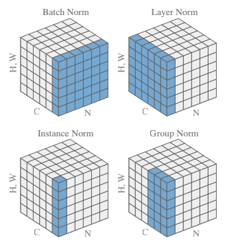
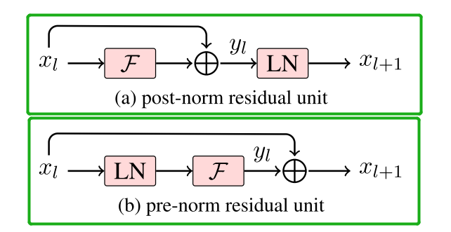

# Normalization

## 前言

归一化 / 标准化都是对数据做变换的方式，将原始的一列数据转换到某个范围，或者某种形态。具体来说：

* 归一化：将数据映射到某个固定区间，通常是 [0, 1]
* 标准化：将原数据分布转变为均值为 0，方差为 1 分布，**原分布类型不变(并非一定是正态分布)**

上述两种方法虽有差异，但在特征工程、机器学习、深度学习中都有应用，主要有以下几点好处：

1. **消除不同特征之间量纲的影响**，一方面保证了不同特征之间的可比性，另一方面机器学习任务中常常会出现距离的计算，距离的计算依赖于量纲较大的那些特征，不消除量纲很容易得到不合理的结果
2. 深度学习方法通常使用梯度下降法进行优化，归一化 / 标准化可以**加快收敛速度**。归一化 / 标准化后的损失函数的等高线图更接近圆形，梯度下降的方向震荡更小，收敛更快，如下图所示(图片来自Andrew Ng)



* ***何时使用归一化，何时使用标准化？***
  * 标准化：在机器学习中，标准化是更加通用的手段，一般而言都可以优先考虑使用标准化
  * 归一化：对数据处理范围有严格要求时使用归一化；在不涉及距离度量、协方差计算的时候，可以使用归一化方法；如果数据不为稳定，存在极端的最大最小值，不要用归一化，果断使用标准化

## 深度学习常用方法

<center>    <br>    <div style="color:orange; border-bottom: 1px solid #d9d9d9;    display: inline-block;    color: #999;    padding: 2px;">Image Credits: <a href="https://arxiv.org/abs/1903.10520">[Siyuan Qiao et al.: Weight Standardization]</a></div> </center>

上面这幅图是在十分经典的描述了各种常见 Norm 方法的示意图，这幅图对于 CVer 比较友好，CV 的输入维度通常为 `(batch_size, input_channels, height, width)`，但并不符合 NLPer 的直觉，NLP 的输入(经过了 embedding)维度通常为 `(batch_size, seq_len, embed_size)`，因此在这里通常存在令人困惑的两种情况：

1. **在概念上依然使用 (N, L(=C), H(=H, W)) 来理解 BN、LN、IN、GN**
2. 但实际使用中常常会使用如下输入维度：NLP 的输入本身是没有 channel 这个概念的，但是也可以通过类比的方法得到 channel 这个概念 -> CV channel 表示一幅图的颜色通道，**那类似的，NLP channel 则可以表示一个 token 的特征通道**，因此**用 channel 含义来表示 NLP 输入维度为 `(batch_size, embed_size(=input_channels), seq_len)`**，经典的 [textCNN](https://arxiv.org/abs/1408.5882) 用的就是这样的表示方法。

此外，深度学习中的 Normalization 一般都指标准化，公式如下所示：

$$
y = \frac{x-E(x)}{\sqrt{Var[X]+\epsilon}}*\gamma+\beta
$$

其中：

* $\epsilon$ 为一个很小的数，通常为 1e-5，用于防止分母为 0，确保数值稳定性
* $\gamma$ 和 $\beta$ 为可学习的仿射参数，分别用于修正标准化后数据的方差和均值，初始时 $\gamma=1$，$\beta=0$。

***不同的标准化方法最大的区别，是上述公式中均值和方差的计算对象不同。***

根据上面四幅图，我们可以发现：

* BN 会得到 channels 组均值方差
* LN 会得到 batch_size 组均值方差
* IN 会得到 batch_size * channels 组均值方差
* GN 会得到 batch_size * channels / G 组均值方差

### 1. Batch Normalization

Batch Normalization 指在***整个 batch* 的每个通道维度上分别做 Normalization**。BN 在 CV 领域应用多，NLP 应用很少

* 对于 CVer：Batch Normalization 作用于 (batch_size, input_channels, height, width)，就是***对整个批次中的所有图片的每个通道分别做 Normalization***，其 $E(x)$ 计算公式如下：

$$
E(x) = \frac{\sum_{N}\sum_{H}\sum_{W}X[n,c,h,w]}{N*H*W}
$$

```python
# pytorch 实现
# N = 16, C = 3, H = 32, W = 32
x = torch.randn([16, 3, 32, 32])
# num_features = C，只需要告诉输入通道数就能进行上述公式的均值计算，方差同理
m = torch.nn.BatchNorm2d(num_features = 3)
normed_x = m(x)
```

[torch.nn.BatchNorm2d](https://pytorch.org/docs/stable/generated/torch.nn.BatchNorm2d.html)

* 对于 NLPer：Batch Normalization 作用于 (batch_size, embed_size(=input_channels), seq_len)，就是***对批次中的所有句子的每个特征通道分别做 Normalization***，同样以 $E(x)$ 的计算为例：

$$
E(x) = \frac{\sum_{N}\sum_{L}X[n,c,l]}{N*L}
$$

```python
# pytorch 实现，torch.nn.BatchNorm1d 的文档中提到了第二维是 features 而不是 seq_len
# N = 16, C = 256, L = 72
x = torch.randn([16, 256, 72])
# num_features = C
m = torch.nn.BatchNorm1d(num_features=256)
normed_x = m(x)
```

[torch.nn.BatchNorm1d](https://pytorch.org/docs/stable/generated/torch.nn.BatchNorm1d.html)

### 2. Layer Normalization

Layer Normalization 指在特征维度做 Normalization，其针对的是 **batch 中的某一个句子(通常在 NLP 中是一个 token ) / 图片**。LN 在 NLP 领域应用多，在 CV 领域应用少。

* 对于 NLPer，Layer Normalization 作用于 (batch_size, seq_len, embed_size) 就是对批次中的一条句子的每个 token 分别做 Normalization，其 $E(x)$ 计算公式如下：(严格意义上，这其实是 Instance Norm)

$$
E(x) = \frac{\sum_{H}X[n,l,h]}{H}
$$

 

```python
# pytorch 实现
# N = 16, L = 72, H = 256
x = torch.randn(16, 72, 256)
# torch.nn.LayerNorm 不分1d/2d，它只负责把(N, *) -> N(, *)
# 通过 normalized_shape 指定标准化的范围，normalized_shape 是一个整数或数组
# normalized_shape = H
m = torch.nn.LayerNorm(256)
normed_x = m(x)
# 这也是 pytorch 官方给的例子，但是其实仔细琢磨你会发现，上面的例子其实是 Instance Norm
# 因为这样会得到 batch_size * seq_len 个均值和方差，但 LN 的定义只会得到 batch_size 个均值方差
# 这也是非常让人困惑的地方，包括 bert 中的 LN，用的实际上都是 IN，但是说的都是 LN...
```

* 对于 CVer，Layer Normalizaiton 作用于 (batch_size, input_channels, height, width) 是对批次内的每张图片(例如包括所有通道)分别做 Normalization，其 $E(x)$ 计算公式如下：

$$
E(x) = \frac{\sum_{C}\sum_{H}\sum_{W}X[n,c,h,w]}{C*H*W}
$$

```python
# pytorch 实现
# N = 16, C = 3, H = 32, W=32
x = torch.randn(16, 3, 32, 32)
# normalized_shape = [C,H,W]
m = torch.nn.LayerNorm([3,32,32])
normed_x = m(x)
```

[torch.nn.LayerNorm](https://pytorch.org/docs/stable/generated/torch.nn.LayerNorm.html)

### 3. Instance Normalization

一句话概括 Instance Normalization: 
* **batch_size = 1 的 batch normalization**
* **input_channel = 1 的 layer normalization**

不过对于 BN 来说，想要效果更好往往需要更大的 batch_size，但是 IN 直接把 batch_size 在计算上视作 1，这在大多数情况下效果都不会很好，除了一些特定的任务，如 style transfer 等

* 对于 CVer，其 $E(x)$ 计算公式如下：

$$
E(x) = \frac{\sum_{H}\sum_{W}X[n,c,h,w]}{H*W}
$$

* 对于 NLPer，其 $E(x)$ 计算公式如下：

$$
E(x) = \frac{\sum_{L}X[n,c,l]}{L}
$$

### 4. Group Normalization

要使得 BN 效果比较好，一般要尽可能把 batch_size 设置得大一些(≥32)，但是某些情况下这是不能实现的。比如数据本身非常大(视频/高分辨率图片)、网络参数非常多等原因，导致显存不够，这时只能被迫减小 batch_size，这会使得 BN 效果打折扣。Group Normalization(GN) 就是这样一种方法，让 norm 不依赖于 batch_size (一种特殊的 LN)

前面提到 IN 等于 input_channel = 1 的 layer normalization，GN 也可以看作是 IN 和 LN 的一个折中办法，他在 input_channel 维度上对 input_channel 分组，然后每个组分别做 normalization。其中分组数 G 为预先定义好的超参数，当 G = 1 时，GN = LN；当 G = C 时，GN = IN

### 5. Root Mean Square Layer Normalization (RMS Norm)

和 layernorm 的思路一样，都是在特征维度上做归一化，但是它**去除了减均值的操作，改为直接除以平方和均值开根号**，部分实验结果表示这样对性能没什么影响(甚至略有提升)，同时可以提升计算效率，因为减均值尤其是方差的计算更复杂，Gopher、LLaMA、T5等大语言模型都采用了RMS norm。
$$
y = \frac{x}{RMS(x)}*\gamma+\beta, \qquad where\quad RMS(x) = \sqrt{\frac{1}{n}*\sum_{i=1}^{n}x_i^2}
$$

### 6. Deep Norm

[Deep Norm](https://arxiv.org/pdf/2203.00555.pdf) 是对 **Post-LN** 的改进，作者通过实验证实了 Deep Norm 在训练深层 transformer 模型的时候具备近乎恒定的更新规模，成功训练了 1000 层的 transformer，认为 Deep Norm 在具备 **Post-LN 的良好性能** 的同时又有 **Pre-LN 的稳定训练**

具体它干了两件事情：

1. DeepNorm在进行Layer Norm之前会以 $\alpha$ 参数**扩大残差连接**
2. 在Xavier参数初始化过程中以 $\beta$​ 减小部分参数的初始化范围

```python
def deepnorm(x):
  return LayerNorm(x * alpha + f(x))

def deepnorm_init(w):
  if w is ["ffn", "v_proj", "out_proj"]:
    nn.init.xavier_normal_(w, gain=beta)
  elif w is ["q_proj", "k_proj"]:
    nn.init.xavier_normal_(w, gain=1)
```

* 定义了“预期模型更新”的概念表示 模型更新的规模量级
* 证明了 $W^Q$ 和 $W^K$ 不会改变注意力输出大小数量级的界限，因而 $\alpha$ 并没有缩小这部分参数
* 模型倾向于*累积每个子层的更新*，从而*导致模型更新量呈爆炸式增长*，从而使*早期优化*变得不稳定
* 使用 Deep Norm 的 "预期模型更新"，在参数 $\alpha$、$\beta$ 取值适当的时候，以*常数为界*

## 使用场景

### 为什么 NLP 常用 LN 而不用 BN

在 NLP 任务中，**序列的长度大小是不相等的**，这就意味着如果我们用 Batch Normalization 处理序列的话，就会**对序列填充的 pad 也进行特征对齐**；其次，不同句子的同一个位置的单词是任意的，对这些同一个位置的单词做 Norm 也是没有意义的。

### [为什么 transformer 使用 LN 而不是 BN](https://www.zhihu.com/question/487766088)

***

此外，BN 和 LN 还有一些明显的差别：

* BN 对 batch_size 很敏感，它的计算和 batch 相关
* LN 适合处理变长数据，它与批次大小和句子长度都无关，只在特征维度上计算
* BN 推理速度更快，它可以直接使用 training mean 和 training variance

### 什么时候需要 Norm 什么时候不需要 Norm

[什么时候需要 Norm 什么时候不需要 Norm](https://www.cnblogs.com/shine-lee/p/11779514.html)

***

### 为什么需要仿射参数

$$
y = \frac{x-E(x)}{\sqrt{Var[X]+\epsilon}}*\gamma+\beta
$$

在上面的式子中，有可学习的两个参数 $\gamma$ 和 $\beta$ ，核心作用是：**为了保证模型的表达能力不因为规范化而下降**

1. 充分利用下层神经元已经学习的能力：假如没有这组参数，那么下层神经元不论如何变化，其输出的结果在交给上层神经元进行处理之前，都将被粗暴地重新调整到这一固定范围。
2. 保证获得非线性的表达能力：规范化会将几乎所有数据映射到激活函数的非饱和区（线性区），仅利用到了线性变化能力，从而降低了神经网络的表达能力。而进行再变换，则可以将数据从线性区变换到非线性区，恢复模型的表达能力。

### model.eval() 对 Norm 的影响

先说结论：model.eval() 对 BN、IN 有影响，对 LN、GN 没有影响

* 因为 BN 和 IN 在 pytorch 中有这么一个参数 `track_running_stats`，指的是是否存储一个全局的均值方差，在 model.eval() 执行后，若 `track_running_stats = True`，则会应用全局的均值方差做归一化，不会再额外计算；否则需要重新计算均值方差，重新计算可能会有坏处：测试的 batch_size 和训练的 batch_size 差距过大的时 BN 和 IN 的均值方差计算结果可能会差距很大，对性能可能产生较大的影响
* 但是 LN 和 GN 在 pytorch 中有这么一句话 `This layer uses statistics computed from input data in both training and evaluation modes.`，说白了就是现场计算均值方差，因为 LN、GN 和 batch_size 无关，所以直接计算就没有什么影响了

引申一个问题：

### model.eval() 和 torch.no_grad() 有什么区别

* model.eval() 的作用是
  1. 暂停使用 dropout，使用全部的网络参数进行计算
  2. 暂停计算 BN、IN 等均值方差，使用训练时记录的全局均值方差进行归一化
  3. model.eval() 不会对梯度造成任何影响
* torch.no_grad() 的作用仅仅是停止梯度的计算和存储，进一步节省推理显存，**它对 dropout 以及 BN、IN 没有任何影响**，因此为了正确的评估模型，一定要记得使用 model.eval()

 ### Pre-Norm 和 PostNorm



* post-norm 在残差之后做归一化，对参数正则化的效果更强，进而模型的鲁棒性也会更好
* pre-norm 相对于 post-norm，因为有一部分参数直接加在了后面，不需要对这部分参数进行正则化，正好可以防止模型的梯度爆炸或者梯度消失 (求导时对 $x_l$ 求导恰好为 1，那么理论上再深的网络链式法则梯度相乘也不会梯度消失或爆炸)，训练更稳定

### 为什么PreNorm 的 LN 要加在 F 的前面，而不是 F 的后面呢？

因为做完 Layer Normalization 之后的数据不能和平常的数据加在一起，如果这样做的话残差中从上一层出来的信息会占很大比重，这显然并不合理。
