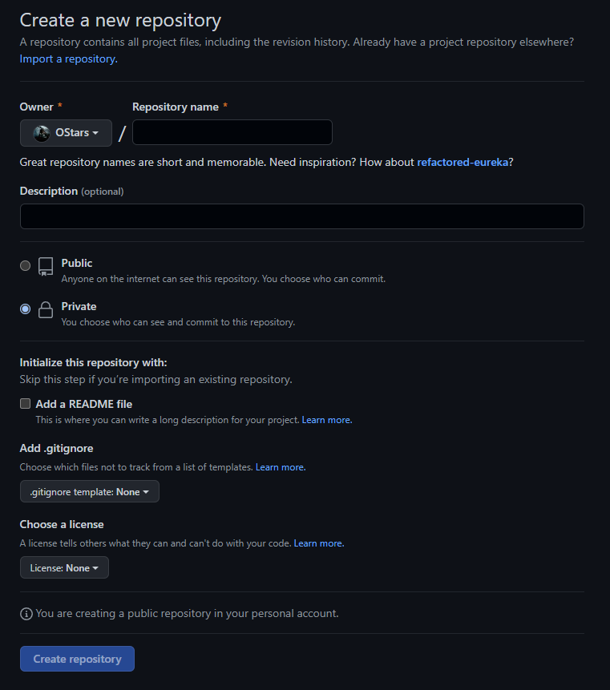

# Git_Remote_Workflow

使用 git 搭配远程仓库(Github、Gitee、自己搭建服务器等)使用，一方面 git 良好的版本控制保证了工作备份，另一方面远程仓库帮助我们在多人、多机器的情况下也能够高效地完成开发，收益颇多，因此用本文记录一下我使用 git + 远程仓库的工作流

## 常用指令

1. `git add .`：将工作区修改提交到暂存区
2. `git commit -m "$msg"`：将暂存区中的所有内容提交到当前分支
3. `git merge $branch`：将指定的分支合并到当前分支上来
4. `git push`：将本地分支的内容推送到远程仓库
5. `git pull`：将远程仓库(某分支)的内容拉取并合并到本地分支上

## 前期准备

设想目前你已经在本地创建了一个 git 仓库，然后想要在 github 上创建一个远程仓库，并且将本地仓库和远程仓库同步起来。

* 将 ssh key 配置到 github 账号下(一台机器这一步只需要做一次就好)

本地 git 仓库和 github 仓库之间的传输是通过SSH加密的，所以需要先将 ssh key 配置到 github 账号下，以便完成身份核验。

在用户主目录下找到 `.ssh` 目录，里面有 `id_rsa` 和 `id_rsa.pub` 文件，`.pub` 文件(这一对文件的名字是可以自己设置的，默认是 `id_rsa`)是公钥可以随意使用，但不能暴露另一个私钥。若 `.ssh` 目录下没有上述两个文件，可在命令行输入下方的代码生成文件

随后登录 github，打开 Account settings -> SSH Keys -> Add SSH Keys，填上你指定的 title，在 Key 文本框中粘贴 `id_rsa.pub` 文件的全部内容，点击 Add Key 即完成配置

```
ssh-keygen -t rsa -C "youremail@example.com"
```


1. 创建本地 git 仓库：

```bash
# 初始化 git 仓库
git init
# 为项目添加 user.name 和 user.email 配置(用于标识修改项目的人的身份)
git config --local user.name $USERNAME
git config --local user.email $EMAIL
```

2. 创建远程仓库

输入远程仓库名称、描述(可选)，选择证书(可选)即可，就在 github 上创建了一个空的远程仓库。

* 因为有本地工作内容了，所以不需要勾选 `ADD a README file`，此项勾选适用于先创建远程仓库，然后本地 `git clone` 远程仓库后再进行本地开发



3. 将本地库与远程库联系起来

```bash
# 在本地仓库中运行该指令，在本地库中关联远程仓库
# origin 是远程仓库的默认叫法，看到 origin 一般都知道是远程仓库
# 后面的地址需要改成刚创建的远程仓库地址(上一步生成的空仓库首页就有该地址)
git remote add origin git@github.com:OStars/Blogs-OStars.git

# 将本地仓库内容全部推送到远程仓库
# $local_branch 标识推送哪个本地分支；$remote_branch 标识推送到哪个远程分支
# 远程库为空，所以第一次推送添加了 -u 参数，后续推送不需要该参数
git push -u origin $local_branch:$remote_branch
```

至此，远程仓库的内容就与本地仓库内容完全一致了，并且建立了联系

## 工作流

***⭐核心流程***

`git checkout -b dev -> git add . -> git commit -m "" -> git push origin dev:main -> git checkout master -> git pull origin main`

1. 本地开发

***⭐关键：多开分支***

首次创建 git 仓库时只有一个 master 分支，即主分支。主分支即最稳定、最正式的分支，我们要确保主分支上的工作是正确且没有问题的，修改的工作逻辑上不应该在主分支上进行。因此使用 `git checkout -b dev` 创建了一个 `dev` 分支并自动切换到该分支下，随后在新创建的开发分支上进一步开发，待开发完成后，再 `git add .` (. 表示把所有修改都提交到暂存区)并使用 `git commit -m “$msg”` 将修改提交到当前所处分支上($msg 最好需要写上有意义的话，例如概括这次修改的主要内容，以便后续查看日志时能够清晰地知道什么节点做了什么样的修改)

2. 提交到远程

完成本地开发后，就将修改及时提交到远程仓库 `git push origin dev:main` (这里默认了修改是在 dev 分支上提交的，并且提交到远程仓库的 main 分支(即主分支)上)

3. 合并主分支

提交到远程仓库后在本地切换回主分支 `git checkout master` ，使用 `git pull origin main` 将最新的修改拉取到本地上，又完成了代码的同步，这样即为一次完成的开发流程。新的循环上述过程即可

⭐上述过程可以频繁一些，例如有些功能比较复杂，不需要等到该功能全部实现再提交，可以将该功能拆解为一些小模块，每个小模块完成并测试通过后即可走一遍上述流程。不然一口气开发完所有再提交，也体现不出版本控制的重要性了，因为总共也就有这一个版本。

