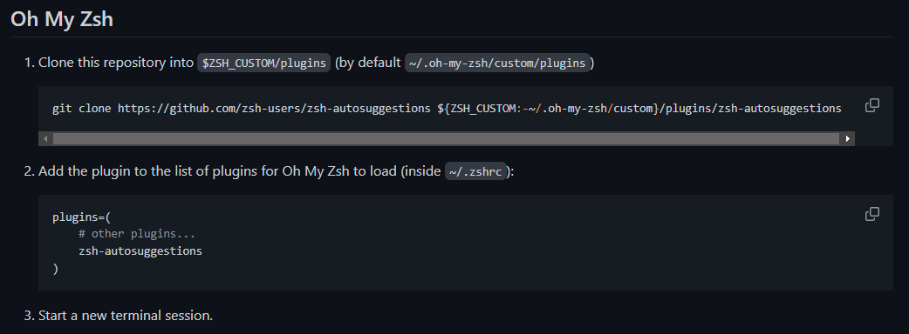
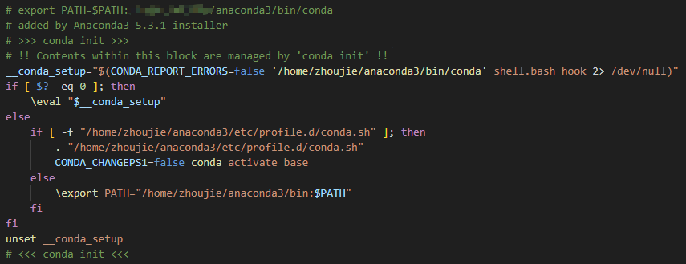

## Zsh & Oh My Zsh

* **Oh My Zsh** 是一款社区驱动的命令行工具，正如它的主页上说的，**Oh My Zsh** 是一种生活方式。它基于 **zsh** 命令行，提供了主题配置，插件机制，已经内置的便捷操作。给我们一种全新的方式使用命令行。
* **Oh My Zsh** 是基于 **zsh** 命令行的一个扩展工具集，提供了丰富的扩展功能。
* 安装 **Oh My Zsh** 前提条件：必须已安装 **zsh**

简言之，zsh 和 bash 一样是一种 shell 的实现方式，但是它使用起来非常复杂，上手难度高，于是有人基于 zsh 开发了 oh my zsh，给我们提供了更简便方式使用 zsh

## Install

1. 安装 zsh

   ```bash
   sudo apt install zsh
   ```

2. 验证安装

   ```bash
   zsh --version
   ```

3. 安装 oh my zsh

   如果网络良好 (随意访问外网) 那么就可以去 [oh my zsh](https://ohmyz.sh/#install) 的官网按它的指示安装

   通过 curl 安装：
   ```bash
   sh -c "$(curl -fsSL https://raw.githubusercontent.com/ohmyzsh/ohmyzsh/master/tools/install.sh)"
   ```
   通过 wget 安装：
   ```bash
   sh -c "$(wget https://raw.githubusercontent.com/ohmyzsh/ohmyzsh/master/tools/install.sh -O -)"
   ```
   如果网络不好 (比如服务器无法访问外网)，那么就手动去浏览器中敲入上面的下载链接 https://raw.githubusercontent.com/ohmyzsh/ohmyzsh/master/tools/install.sh，然后复制页面的全部内容，在需要安装 oh my zsh 的机器上新建一个文件 `install.sh`，然后把页面的内容粘到这个文件里后执行：
   ```bash
   bash install.sh
   ```
   这一步只要网络不出问题 (因为里面需要 git clone Oh My Zsh 的仓库)，那就顺利结束了
   
   中途它会提示 `Do you want to change your default shell to zsh? [Y/n]`，一般填个 `y` 就行了

## Configuration

Oh My Zsh 的所有配置都可以在 `~/.zshrc` 中完成 (就和 `~/.bashrc` 差不多)，更改了 `~/.zshrc` 后记得执行 `source ~/.zshrc` 使新的配置生效

1. 主题配置

   ```bash
   # Set name of the theme to load --- if set to "random", it will
   # load a random theme each time oh-my-zsh is loaded, in which case,
   # to know which specific one was loaded, run: echo $RANDOM_THEME
   # See https://github.com/ohmyzsh/ohmyzsh/wiki/Themes
   ZSH_THEME="robbyrussell"
   ```

   直接去 https://github.com/ohmyzsh/ohmyzsh/wiki/Themes 里面找，有非常多主题，挑一个喜欢的主题更换掉 `ZSH_THEME` 的值就好了

2. 插件配置

   ```bash
   # Which plugins would you like to load?
   # Standard plugins can be found in $ZSH/plugins/
   # Custom plugins may be added to $ZSH_CUSTOM/plugins/
   # Example format: plugins=(rails git textmate ruby lighthouse)
   # Add wisely, as too many plugins slow down shell startup.
   plugins=(git)
   ```

   `plugins` 的值标识当前 zsh 使用哪些插件，像 `git` 是 zsh 内置的插件，未内置的插件需要另外下载

   常用的插件有 `zsh-autosuggestions`(命令提示)、`zsh-syntax-highlighting` (命令高亮分辨正确性)

   安装的方法都差不多，直接搜插件的 github 仓库，然后找他的安装指南，按照指南安装

   以 `zsh-autosuggestions`为例，它的安装指南在 https://github.com/zsh-users/zsh-autosuggestions/blob/master/INSTALL.md，找到里面的 Oh My Zsh 安装方法，第一步下载 (git clone，如果网不好就手动下载下来，然后放到第一个命令中指定的位置即可)；第二步把插件名字加入到 `~/.zshrc` 中的 `plugins` ；第三步执行 `source ~/.zshrc` 即可 (也可能需要开一个新的终端才会生效)

   

   

## Tips

### 无法识别 Conda 命令

在安装 oh my zsh 之前安装 conda 会导致刚装好的 oh my zsh 无法识别 Conda 命令，是因为 `~/.zshrc` 中缺少 conda 的相关配置，解决办法是把 `~/.bashrc` 中的 `conda init` 部分的代码粘到 `~/.zshrc` 中：



上面这段代码是用 bash 安装 conda 时 conda 自动写入 `~/.bashrc` 的，直接粘过来用就好了