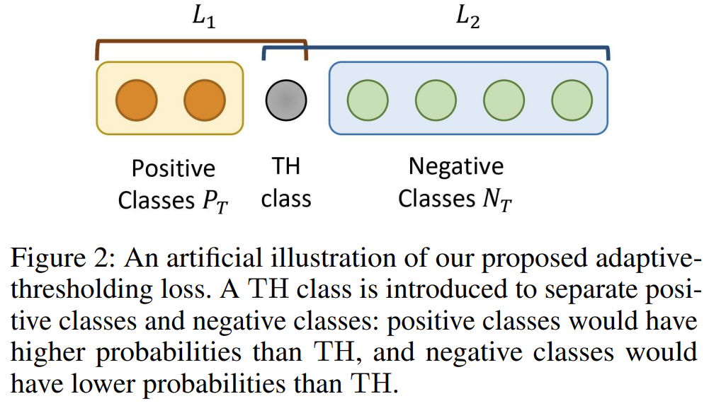

>  [Document-Level Relation Extraction with Adaptive Thresholding and Localized Context Pooling](https://ojs.aaai.org/index.php/AAAI/article/view/17717)

**文章动机：**关系抽取分类器最终输出为0-1之间的概率值，需要一个阈值来得到最终的关系标签。 因此一个常规的做法是枚举一定量的阈值，然后选取使得评测指标（对于关系抽取来说即 F1 score）最大的阈值作为最终阈值。 然而对于不同关系类别，模型会有不同的置信度，因此使用一个全局的阈值不是最优的。 

**具体做法：**为解决这个问题，作者提出一个自适应阈值方法，具体描述如下。对于一个实体对 $T = (e_s, e_o)$ ， 将其标签分为两部分正类别标签 $P_T$ 和负类别标签 $N_T$

*  $P_T \in R$ 表示实体对 $T$ 包含的关系的集合，如果实体对不含有任何关系，则该集合为空集
*  $N_T \in R$ 表示实体对 $T$ 不包含的关系的集合，如果实体对不含有任何关系，则该集合为所有关系类别标签集合

如果一个实体对关系预测正确，则正类别的分数应该都高于阈值并且负类别的分数都低于阈值。 基于此作者引入一个阈值类 $TH$。训练时，该类别和其他关系类别一同学习； 测试时，输出分数高于 $TH$ 类别的关系为最终预测的关系；若都低于 $TH$ 类别，则输出该实体对没有关系。 为学习到上述 $TH$ 类别，作者**基于二元交叉熵损失**提出了一个新的损失函数：
$$
L_1 = - \sum_{r\in P_T}{log(\frac{exp(logits_r)}{\sum_{r'\in P_T \cup TH}{exp(logits_r')}})} \\
L_2 = -log(\frac{exp(logits_{TH})}{\sum_{r'\in N_T \cup TH}{exp(logits_{r'})}})	\\
L = L_1 + L_2
$$
通过公式可以看出

* $L1$ 整体要小，分子要尽可能大就是正例的 logits 要大；分母要尽可能小就是 TH 类的 logits 要小
* $L2$ 整体要小，分子要尽可能大就是 TH 类的 logtis 要大；分母要尽可能小就是负类的 logits 要小




**代码实现：**

```python
import torch
import torch.nn as nn
import torch.nn.functional as F


class ATLoss(nn.Module):
    def __init__(self):
        super().__init__()

    # 仅适用于原来就是使用二元交叉熵损失的任务
    # 我们需要手动地给 labels 加一个 TH 类的维度, 按下面的逻辑默认加在第 0 维
    def forward(self, logits, labels):
        # TH label
        th_label = torch.zeros_like(labels, dtype=torch.float).to(labels)
        th_label[:, 0] = 1.0
        labels[:, 0] = 0.0
				
        # p_mask 中除了 TH 类全体和原来是 1 的位置都是 0
        p_mask = labels + th_label
        # n_mask 中把 label 中原来全是 1 的位置都置为 0, TH 类全体为 1
        n_mask = 1 - labels

        # Rank positive classes to TH
        # 把 p_mask 中为 0 的位置都置为负无穷, 即只计算 TH 和正类
        logit1 = logits - (1 - p_mask) * 1e30
        loss1 = -(F.log_softmax(logit1, dim=-1) * labels)

        # Rank TH to negative classes
        # 把 n_mask 中为 0 的位置都置为负无穷, 即只计算 TH 和负类
        logit2 = logits - (1 - n_mask) * 1e30
        loss2 = -(F.log_softmax(logit2, dim=-1) * th_label)

        # Sum two parts
        loss = loss1 + loss2
        loss = loss.mean()
        return loss

    def get_label(self, logits, num_labels=-1):
        th_logit = logits[:, 0].unsqueeze(1)
        output = torch.zeros_like(logits).to(logits)
        # 取出 logits 中大于 th 类的那些位置
        mask = (logits > th_logit)
        if num_labels > 0:
            top_v, _ = torch.topk(logits, num_labels, dim=1)
            top_v = top_v[:, -1]
            mask = (logits >= top_v.unsqueeze(1)) & mask
        # 把大于 th 类的那些位置都预测为正例即可
        output[mask] = 1.0
        output[:, 0] = (output.sum(1) == 0.).to(logits)
        # 如果后续用不到 th 类的值了, 记得取 output[..., 1:] 才是需要的标签空间
        return output
```

